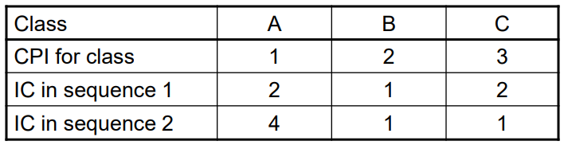
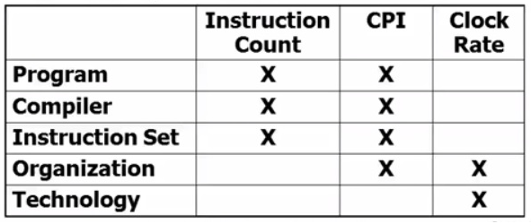
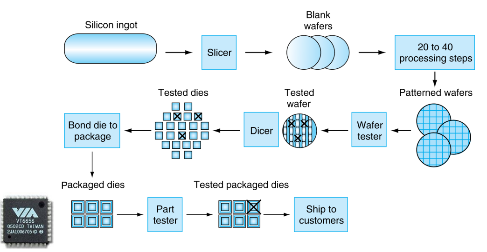

---
export_on_save:
  phantomjs: "pdf"
---

Computer Architecture Lecture 2

# Simple Q&A

Q: 為什麼電腦不用十進位而用二進位？
A: signal 的電壓只能分成 high 和 low => 只能有兩種狀態 => 1 or 0

Q: What is Computer Architecture?
A: Computer Architecture = Instruction Set Architecture + Computer Organization

# Performance

## Terminology 術語

* Response time
    * def : 一份工作從進入系統開始到全部完成離開系統所花的一個完整的時間。
    * 重視的是單一工作 它完成的 "時間的長短"
* Throughput :
    * def : 一個單位時間裡面這個系統它所能夠完成的總工作量
    * 重視的是在一個時間裡面這個系統它所能夠完成的 "總工作量"

> #### Example 1 : 從原本比較慢的處理器 換成了比較快的處理器
> Response time : 應該會縮短因為處理器的速度變快
> Throughput : 一個單位的時間裡面這個處理器它能夠 "完成的工作總量" 應該也能夠增加

> #### Example 2 : 增加處理器數目
> Response time :
> 針對單一的工作，這份工作它沒有辦法同時 "切割成好幾個小的部分" 然後丟到不同的處理器來執行的話，那麼我們可以預期的事情是實際上它的 Response time 應該沒有辦法減少。反之我們可以把這份工作 "切成好幾個小部分" 丟到不同的處理器同時地來執行的話，那麼 Response time 就應該有機會可以減少。而這個概念就是所謂的 "平行計算"
>
> Throughput :
> 如果我們能夠讓這個系統裡面的處理器的數量上升的話，那麼自然而然它能夠完成的工作總量，也應該能夠大幅地增加

## Relative Performance

* 計算效能的簡單公式就是**執行時間的倒數** :  $Performance = \dfrac{1}{Execution \; Time}$

* 常常說 A 的效能是 B 的 n 倍:  $\dfrac{Performance_A}{Performance_B} = \dfrac{Execution \; time_B}{Execution \; time_A}$

> #### Example:
> 相同程式在 A 上跑 10s，在 B 上跑 15s，依造公式，A 的效能就是 B 的 1.5 倍
>
> $\dfrac{Execution \; Time_B}{Execution \; Time_A} = \dfrac{15s}{10s} = 1.5$

## Measuring Execution Time

知道效能怎麼算之後，就要知道 Execution Time 要如何去測量，常見有以下兩種數值評估

* Elapsed time (實際時間)
    * 總共的執行時間，包含 Processing, I/O, OS overhead, idle time 等等
    * 通常拿來比較系統的效能
* CPU time
    * 只計算真正在 CPU 上計算的時間，相對 Elapsed time 來說扣除 I/O time, other jobs’ shares 等時間
    * 包含了 user cpu time 和 system cpu time
    * 不同的程式受到 cpu 和 system 效能的影響也不盡相同

## CPU Basic

電腦裡面最核心的部分就是 processor 處理器，而處理器的工作是依據使用者給它的命令，再依照這些命令來產生對應的行為，而這些命令我們叫做 `instruction` 指令

我們知道電腦本身是一個 `sequential circuit` 循序電路，而讓 `sequential circuit` 能夠正常順利的運作，最關鍵的就是需要有一個 clock 去控制資料的同步以及更新，也因此電腦最基本的時間單位就是 `clock cycle`

* Clock period (time) : 一次 clock cycle 的時間長度
* Clock frequency (rate) : 單位時間內有多少次 clock cycle (Clock period 倒數)

## CPU Time 的計算方式

$CPU \; Time = CPU \; Clock \; Cycles × Clock \; Time = \dfrac{CPU \; Clock \; Cycles}{CPU \; Clock \; Rate}$
(一個程式在 CPU 裡面執行多少個 clock cycle $×$ clock cycle 花了多少的時間)

以上公式可以得知提升 CPU 效能的方法有幾種
* 減少 CPU Clock Cycles 的數量

* 增加 Clock frequency (rate)

  ==> 硬體設計必須常常衡量 clock cycles 和 clock rate 的取捨

> #### Example:
> Computer A : 2GHz clock rate, 10s CPU time，現在想要設計一個 Computer B:6s CPU time，fast clock rate，但是 clock cycles 只能是 A 的 1.2 倍，請問電腦 B 最快可以到多少 clock rate？
>
> ---
>
> $Clock \; Rate_B = \dfrac{Clock \; Cycles_B}{CPU \; Time_B} = \dfrac{1.2 × Clock \; Cycles_A}{6s}$
>
> $Clock \; Cycles_A = CPU \; Time_A × CPU \; Clock \; Rate_A = 10s × 2GHz = 20 × 10^9$
>
> $Clock \; Rate_B = \dfrac{1.2 × 20 × 10^9}{6s} = 4GHz$

## IC && CPI

$CPU \; Clock \; Cycles$ 的計算方式為 :

$Clock \; Cycles = Instruction \; Count(IC) × Cycles \; per \; instruction(CPI)$
(一個程式有多少要執行的 Instruction $×$ 每個 Instruction 需要的 Clock Cycles 次數)

* Instruction Count 由 program(演算法), ISA and compiler 決定
* Average cycles per instruction
    * CPI 會跟 "硬體" 有關，同時也是跟 "實際上這個程式的執行" 有關
    * 每一個指令所需要執行的cycle是不盡相同的
        * 這個時候我們會用一個 "average CPI" 來代表整體的執行 cycle

> #### Example:
> Computer A: Cycle Time = 250ps, CPI = 2.0,   Computer B: Cycle Time = 500ps, CPI = 1.2
> 兩台電腦有相同的 ISA，請問哪一種電腦比較快，快多少？
>
> ---
>
> 同樣的程式，相同的 ISA  ==>  IC 都一樣
>
> $CPU \; Time = IC × CPI × Clock \; Time$
> $CPU \; Time_A = IC × 2.0 × 250ps = IC × 500 × 10^{12}$
> $CPU \; Time_B = IC × 1.2 × 500ps = IC × 600 × 10^{12}$
> $Time_A < Time_B$  ==>  A is faster!
> $\dfrac{Time_A}{Time_B} = \dfrac{600}{500} = 1.2$  ==>  by this much

## CPI in More Detail
如果 instruction classes 有不同數量的 Clock Cycles，則計算方式為 :

$Clock \; Cycles = \sum_{i=1}^{n} (CPI_i × Instruction \; Count_i )$

Weighted average CPI :

$CPI = \dfrac{Clock \; Cycles}{Instruction \; Count} = \sum_{i=1}^{n} (CPI_i × \underbrace{\dfrac{Instruction \; Count_i}{Instruction \; Count}}_{Relative \; frequency})$

> #### Example
>  如附圖有 A, B, C 三種 instructions，建構出兩種 compiled code sequences，則各個 Avg.CPI 是多少？
> 
>
> ---
>
> $Sequence_1:$
>
> $IC=5,\;Clock \; Cycles = 2×1 + 1×2 + 2×3 = 10,\;Avg.CPI_1 = 10/5 = 2.0$
>
> $ Sequence_2:$
>
> $IC=6,\;Clock \; Cycles = 4×1 + 1×2 + 1×3 = 9,\;Avg.CPI_2 = 9/6 = 1.5$

## Sum up

$CPU \; Time = \dfrac{Seconds}{Program} = \dfrac{Instructions}{Program} × \dfrac{Cycles}{Instructions} × \dfrac{Seconds}{Cycles}$

* 一個程式有多少個指令 $×$ 每個指令需要多少個 cycle 來執行 $×$ 每個 cycle 花了多少時間。
* 把這些東西相乘起來就是一個程式在CPU裡面執行所花的時間。
* 提升 CPU 的效能就應該要從這些地方來著手。

## Aspects of CPU Performance (X 表示有相關)

> Instruction Set 指令集特性
* CISC (Complex instruction set computer)
    * 指令集比較複雜(一個指令它可以做很多件事情)
    * Instructions Count 較少，每個 Instructions 需要的時間較長。
    * Pros
      * 撰寫組合語言方便，擁有大量指令可完成複雜工作
    * Cons
      * CPI 較大
    * 格式與長度不固定
* RISC (Reduced instruction set computer)
    * 指令集比較精簡(需要花的 Instructions Count 會比 CISC 來得多)
    * Instructions Count 較多，每個 Instructions 需要的時間較短。
    * Pros
      * 擁有少量指令且功能簡單，可對指令進行特殊設計，在大部份的情況下會有較佳的效率
    * Cons
      * Instructions Count 較多
    * 格式與長度固定
* 現今的 cpu 通常採用 RISC 和 CISC 混合式設計
> Organization 處理器本身的架構
* single cycle、multi cycle、pipeline
* CPU 的 clock 的頻率 clock rate, clock frequency
> Technology 半導體的技術...

# Power Consumption

* Static Power Consumption: leakage power (漏電)
* Dynamic Power Consumption: 從 0 變 1，1 變 0 所需的電
* In CMOS IC technology :

$Dynamic \; Power \; Consumption = \dfrac{1}{2} × Capacitive \; load × Voltage^2 × Frequency$

* The power wall
    * We can’t reduce voltage further and We can’t remove more heat

> #### Example
> 假設現在有一顆新的 CPU 有以下素質，那能減少多少程度的電力？
> *   85% of capacitive load of old CPU
> *   15% voltage and 15% frequency reduction
>
> ---
>
> $\dfrac{P_{new}}{P_{old}} = \dfrac{0.85C_{old} × ({0.85V_{old}})^2 × 0.85F_{old}}{C_{old} × {V_{old}}^2 × F_{old}} = 0.85^4 = 0.52$
# Multi-Core

> 為何發展多核心技術？

1. 指令集並行處理問題 : 
    * 微處理器能同時執行多條指令，以便提高工作速度，當我們提高處理器的 $Cycle \; Rate$ 時，處理器每次能找到並執行更多指令。
    * 問題在於從程式中找到越來越多可並行運行的指令是非常困難的事情，隨著 $Cycle \; Rate$ 不斷提高，指令級並行處理的效果會越來越不明顯。
2. 記憶存儲問題 : 
    * 處理器時鐘頻率的提升速度遠遠超過記憶體的時鐘頻率，如此一來性能的提升不再像過去一樣明顯，使我們不斷添加越來越大的快取記憶體及其他技術，以便緩解此問題。
    * 而多核心技術可以放慢提高處理器時鐘頻率的腳步，讓情況不再惡化
3. 功率 Power :
    * 增加 $Cycle \; Rate$。超頻性能增加13%，功率消耗會增加73%，非常不划算
    * 反向思考，降低 $Cycle \; Rate$，增加核心數，以下例子可節省 75% 的功率。

* 公式 : $Energy = time × frequency^3$, has CPU A and B :
* $A: 1 \; Processor,\; Cycle \; Rate = f \Rightarrow E = t × f^3$
* $B: 2 \; Processors,\; Cycle \; Rate = 0.5f \Rightarrow E = \underbrace{2×t}_{2 \; Processors} × {(0.5f)}^3 = 0.25(t × f^3)$

> Parallel Programing

* Compare with instruction level parallelism
    * Hardware executes multiple instructions at once
    * Hidden from the programmer
* Hard to do
    * Programming for performance
    * Load balancing
    * Optimizing communication and synchronization

# Manufacturing ICs Cost

> 製作 ICs 约需 400 多道工序！

* wafer -- 晶圓  &&  die -- 芯片(晶圓切割後的單位)
* Yield  -- proportion of working dies per wafer (晶圓上芯片的合格率)

$Cost \; per \; die = \dfrac{Cost \; per \; wafer}{Dies \; per \; wafer × Yield}$

$Dies \; per \; Wafer \approx \dfrac{Wafer \; area}{Die \; area}$

$Yield = \dfrac{1}{(1 + (Defects \; per \; area × Die \; area/2))^2}$

* IC 的成本和面積不良率有關
    * Wafer cost and area are fixed
    * Defect rate determined by manufacturing process
    * Die area determined by architecture and circuit design

# MIPS: Millions of Instructions Per Second

$MIPS = \dfrac{Instruction \; Count}{Excution \; Time \times 10^6} = \dfrac{Instruction \; Count}{\dfrac{Instruction \; Count \times CPI}{Clock \; Rate} \times 10^6} = \dfrac{Clock \; Rate}{CPI \times 10^6}$

不能夠拿來解釋：
* 不同電腦的 ISAs
* 不同 instructions 的複雜程度
    - CPI varies between programs on a given CPU (Can’t have single MIPS index for a processor)

# Amdahl’s Law

$T_{improved} = \dfrac{T_{affected}}{Improvement\: factor}+T_{unaffected}$

提升效能的關鍵在於**改進的部分它的執行時間比率佔整體執行時間的比率是多少**，如果越高就代表我們的改進對於整體系統的效率提升會比較多，反之就會比較少。

> #### Example
> 臺北到臺中坐車 3 小時，臺中到高雄坐車要 4 小時，今天從臺北到臺中由朋友的超跑載，只要 2 小時，請問速度提升了多少？
>
> ---
>
> Speedup = $\dfrac{1}{\frac{3}{7} \times \frac{2}{3}+\frac{4}{7}} = \dfrac{7}{6}$

