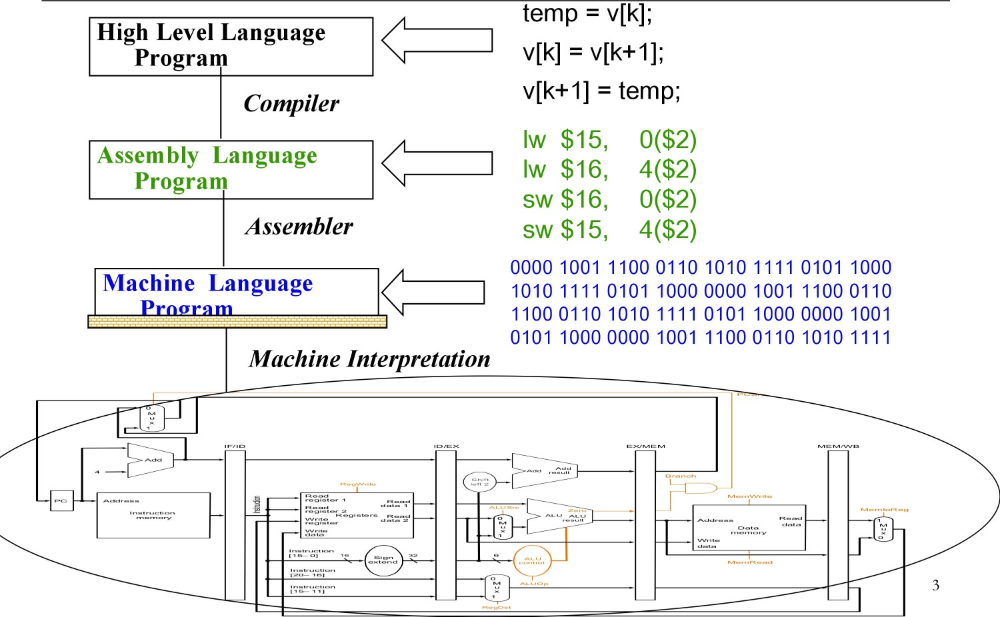
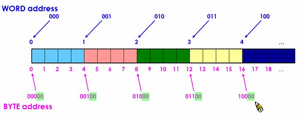
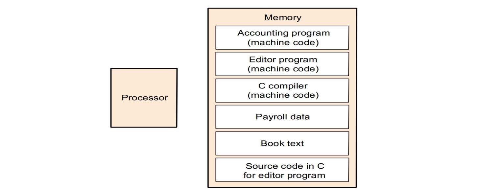
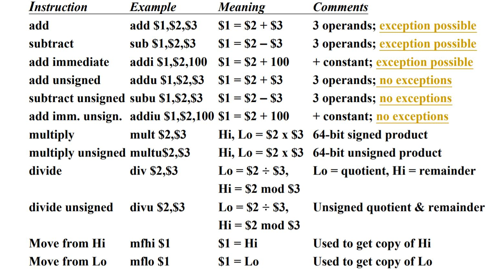
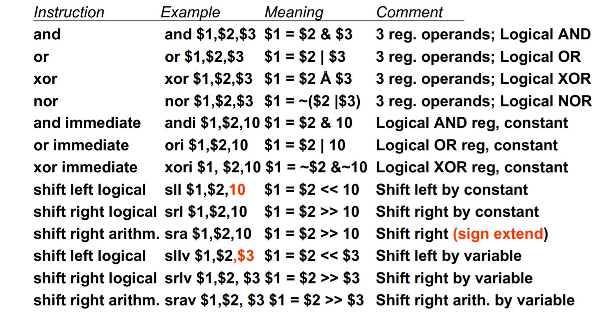
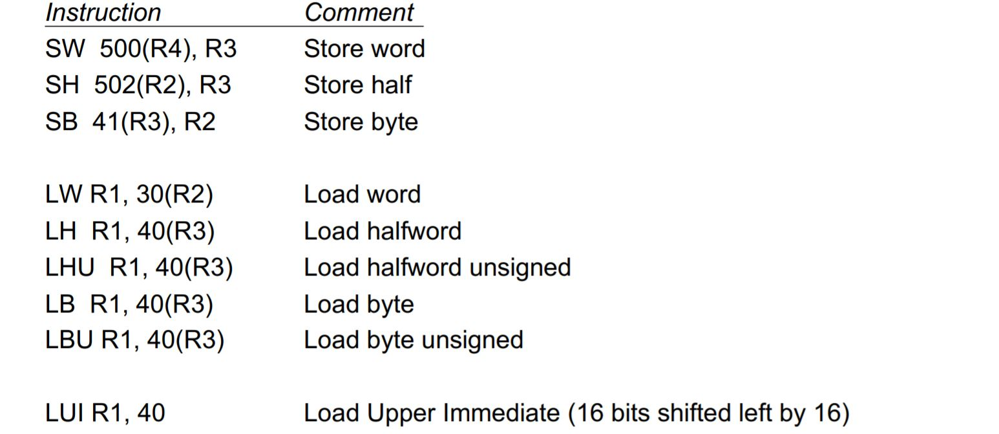
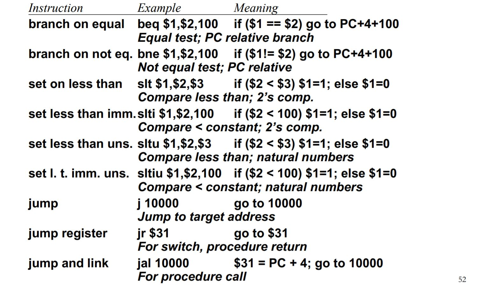

---
export_on_save:
  phantomjs: "pdf"
---

Computer Architecture Lecture 3

# Instruction Set Architecture

## Levels of Representation



## Interface Design Guide

1.  能安裝在不同機器上(portability, compatibility)
2.  能夠有多種的應用方法(generality)
3.  對於 higher levels 要能提供便利的功能
4.  對於 lower levels 要有效率的執行指令

>   Instruction Set 是一個 software 和 hardware 之間的 interface

## ISA Design Principle

-   Design Principle 1 : Simplicity favors regularity(簡單有易於規則)
-   Design Principle 2 : Smaller is faster(小就是快)
-   Design Principle 3 : Good design demands good compromises(好的設計需要好的折衷)
-   Design Principle 4 : Make the common case fast

## Terminology 術語

* 指令集所提供的運算種類(以下三種為電腦指令集的基本必須，其他種類則是設計上的取捨)
  * data operation instruction(資料運算指令)
  * data transfer instruction(資料搬動指令)
  * flow control instruction(流程控制指令)

# MIPS

1.  RISC Instruction set
2.  MIPS指令全部都是 32bits ==> **Design Principle 1**
3.  32 個 General Purpose registers( $\$0 ~ \$31$ )，每個 register 都有一個名稱：

|   Name    | Register number |                  Usage                   |
| :-------: | :-------------: | :--------------------------------------: |
|   $\$zero$   |        0        |           the constant value 0           |
| $\$v0-\$v1$ |       2-3       | values for results and expression evaluation |
| $\$a0-\$a3$ |       4-7       |                arguments                 |
| $\$t0-\$t7$ |      8-15       |               temporaries                |
| $\$s0-\$s7$ |      16-23      |                  saved                   |
| $\$t8-\$t9$ |      24-25      |             more temporaries             |
|    $\$gp$    |       28        |              global pointer              |
|    $\$sp$   |       29        |              stack pointer               |
|    $\$fp$    |       30        |              frame pointer               |
|    $\$ra$    |       31        |              return address              |

-   Register $\$1$($\$at$) 保留給組譯器使用, $\$26$-$\$27$ 保留給作業系統核心使用
-   Why 32? Not 128, 256, 1024?  ==> **Design Principle 2**

4.  32 個浮點數(float)型 register，每個 register 也是 32bit

5.  特殊運用 register : HI, LO, PC ( program counter )

6.  **所有跟 processor 有關的運算，運算子都要在 register 裡面進行** (Load/Store architecture)

    若要對記憶體進行運算，只能透過 Load/Store 將資料從記憶體取出放到暫存器再重新運算。

## Arithmetic Operations

### Register operands

在 MIPS 中: 一個運算子(Operators)指令必須有三個運算元(operands) ==> **Design Principle 1**

> #### Example
> From C to MIPS: f = ( g + h ) - ( i + j );
> f, g, h, i and j are stored in registers \$s1, \$s2, \$s3 and \$s4 and \$s5
>
> ---
>
> ```assembly
> add $t0, $s2, $s3 	# g + h
> add $t1, $s4, $s5;	# i + j
> sub $s1, $t0, $t1; 	# f = () - ()
> ```

#### Immediate Operands(常數運算元)

經常被我們所使用到的常數往往都並不大(例如 "1")。如果只能使用前面所提到的 lw、sw 這樣的指令，當需要使用這些常用的常數時都必須把常數從 memory 搬到 register 後才能使用。這樣的話就會有很多不必要的 instruction count。

為了解決這樣的問題，把一些經常使用到的常數直接的嵌入到指令裡，當我們的 prossesor 把指令讀出來的同時其實也已經把常數給讀出來了。 ==> **Design Principle 4**

>   #### Example: addi (add immediate)
>
>   ```
>   addi $29, $29, 4
>   ```
>   把 $\$29$ 號暫存器裡面的值跟常數 4 相加，加完的結果再把它放到 $\$29$ 號暫存器裡面。

### Logical operations(邏輯運算)

#### Shift

運用: 乘上 2*n 倍時會比 mul 快。 a *= 8 ==> sll $\$s0$, $\$s0$, 3(in MIPS)

#### OR & ORI

```asm
or   $t0, $t1, $t2 	  # $t0 = $t1 | $t2
ori  $t0, $t0, 0x00ff # $t0 = $t0 | 0x00ff
```

#### AND & ANDI

```asm
and  $t0, $t1, $t2 	  # $t0 = $t1 & $t2
andi $t0, $t0, 0x0 	  # $t0 = $t0 & 0x0
```

#### NOR

```asm
nor  $t0, $t1, $t2 	  # t0 = ~($t1 | $t2)
```

### Integer operations(整數運算)

#### multiply

```assembly
mult $t1, $t2 # $t1 * $t2 
```

*   兩個 32 bits 可以產生 64 bits 的結果，所以另外用 HI 和 LO 兩個 register 儲存運算結果。


*   較高的 32 bits 存在 HI，較低的 32 bits 存在 LO，再用以下兩個 Instructions 存取

```assembly
MFHI $t0 # $t0 = HI -- move from HI
MFLO $t0 # $t0 = LO -- move from LO
```

>    $\underbrace{00011111111111111111111111111111}_{HI} \; \;  \underbrace{11000000000000000000000000000000}_{LO}$

*   MIPS 也有提供 mul 若確定不會超過 32bit 就可以用 用這個就會自動把 Lo 放到 register 上

>   ```assembly
>   mul $t0 $t1 $t2 # $t0 = $t1 * $t2
>   ```

#### divide

```assembly
div $t1, $t2 # $t1 / $t2 
```

*   會產生商和餘數兩種結果，另外用 HI 和 LO 兩個 register 儲存運算結果。


*   餘數存在 HI，餘數存在 LO，再用 MFHI 和 MFLO 存取

```assembly
MFHI $t0 # $t0 = HI(餘數 Remainder)
MFLO $t0 # $t0 = LO(商數 Quotient)
```

## Memory operations

為 Data transfer instructions 指令 (lw, sw)

可視為一維陣列，用 pointer 存取，Offset 是以 pointer 作為基礎(pointer base)的偏差值

>   ```asm
>   lw $t0, offset(pointer)		# t0 = mem[offset(bytes)+pointer]
>   sw $t0, offset(pointer)		# mem[offset(bytes)+pointer] = $t0
>   ```
>   * pointer 要存在 regsiter 裡，offset 只能是常數(const)

> #### Example1
>
> From C to MIPS: g = h + A[8];
> address of array A is $\$s3$. Each element of array A is 1 word (4 bytes).
> g and h are stored in registers $\$s1$ and $\$s2$.
>
> ---
>
> ```assembly
> lw	$t0, 32($s3)	# $t0 gets A[8], 32 = index * 4 (bytes)
> add $s1, $s2, $t0	# g = h + $t0
> ```

> #### Example2 ( Only can Use add, lw instructions. )
> From C to MIPS: g = h + A[i];
> address of array A is $\$s3$. Each element of array A is 1 word (4 bytes).
> g, h and i are stored in registers $\$s1$, $\$s2$ and $\$s4$.
>
> ---
>
> ```assembly
> add $s4, $s4, $s4	# i = i + i
> add $s4, $s4, $s4	# i = i + i, set offset
> add $s3, $s3, $s4	# A = A + i (address up to offset)
> lw	$t0, 0($s3)		# $t0 gets A[8], 32 = index * 4 (bytes)
> add $s1, $s2, $t0	# g = h + $t0
> ```

### Representation of Characters

*   ASCII (American Standard Code for Information Interchange)
    *   用 8 bits(1 bytes) 來表示一個字元
    *   MIPS provides instructions to move bytes:

```assembly
lb $t0, 0($sp) #Read byte from source
sb $t0, 0($gp) #Write byte to destination
```

*   Unicode (Universal Encoding)
    *   用 16 bits(2 bytes) 來表示一個字元
    *   java 就是用 unicode 表示自字元
    *   MIPS provides instructions to move 16 bits:

```assembly
lh $t0, 0($sp) #Read half-word from source
sh $t0, 0($gp) #Write half-word to destination
```

### byte address and word address

* 4 byte = 1 word



* byte address 和 word address 相差四倍(2^2)，所以 byte address 最低位元的兩個 bit 一定為 0

### Alignment

所有的 word 被擺到記憶體的時候，它的"起始位址"一定要是 4 個 byte 的整數倍


### Endianness

1 word = 4 bytes，每一個 byte 所**擺放的順序**決定了它是 Big Endian 或是 Little Endian

*   Big Endian: 把最高位元放在 word 的起始位址
*   Little Endian : 把最低位元放到 word 的起始位址

>   #### Example
>
>   How is “12345678h” stored in memory?
>
>   ---
>
>   | addr -->      | 00   | 01   | 10   | 11   |
>   | ------------- | ---- | ---- | ---- | ---- |
>   | Big Endian    | 12   | 34   | 56   | 78   |
>   | Little Endian | 78   | 56   | 34   | 12   |

## Branch instructions(流程控制)

### Conditional branches

```assembly
beq reg1, reg2, L1 # Go to statement L1 if [reg1] == [reg2]
bne reg1, reg2, L2 # Go to statement L2 if [reg1] != [reg2]
```

### Unconditional branches

```assembly
j L1 # Go to statement L1
```

>   #### Example1: "IF" into MIPS
>
>   ```c
>   if (i == j)
>   	f = g + h;
>   else
>   	f = g – h;
>   ```
>
>   f: $\$s0$, g: $\$s1$, h: $\$s2$, i: $\$s3$, j: $\$s4$
>
>   ---
>   ```assembly
>   	bne $s3, $s4, Else	# go to "Else" if i != j
>   	add $s0, $s1, $s2	# f = g + h
>   	j Exit			   # go to Exit
>   Else:
>   	sub $s0, $s1, $s2	# f = g – h
>   Exit:
>   ```

>   #### Example1: "while" into MIPS
>
>   ```c
>   while (save[i] == k)
>   	i += 1
>   ```
>
>   i: $\$s3$, k: $\$s5$
>
>   ---
>   ```assembly
>   Loop: sll $t1, $s3,2 	# $t1 = 4*i
>   	add $t1, $t1, $s6 	# $t1 = address of save[i]
>   	lw $t0, 0($t1) 		# $t0 = save[i]
>   	bne $t0, $s5, Exit 	# go to Exit if save[i] != k
>   	addi $s3, $s3, 1	# i++
>   	j Loop 			   # go to loop
>   Exit:
>   ```

### Test for Inequalities(不相等)

```assembly
slt $reg, $reg2, $reg3
# if ($reg2 < $reg3)
#	$reg1 = 1;
# else $reg1 = 0;
```

>   #### Example
>
>    if (g < h) goto Less; (g: $\$s0$, h: $\$s1$)
>
>   ---
>
>   ```assembly
>   	slt $t0, $s0, $s1 # $t0 = 1 if g < h 
>   	bne $t0, $0, Less # goto Less if $t0 != 0
>   Less:
>   ```

*   MIPS 裡不包含 “branch on less than” 的指令，因為它的結構太複雜

### Case/Switch Statement

```assembly
jr $reg
```

*   欲跳至的位置存在 $reg 裡，就有 32 bits 的 address 可用

>   #### Example
>
>   ```assembly
>   Switch (k) {
>   	case 0: f = i+j; break;
>   	case 1: f = g+h; break;
>   	case 2: f = g-h; break;
>   	case 3: f = i-j; break;
>   }
>   ```
>
>   k: $\$s5$, f: $\$s0$, g: $\$s1$, h: $\$s2$, i: $\$s3$, j: $\$s4$, $\$t2$ = 4, Jump address table:
>
>   | Label | address  |
>   | ----- | -------- |
>   | L3    | $\$t4$ + 12 |
>   | L2    | $\$t4$ + 8  |
>   | L1    | $\$t4$ + 4  |
>   | L0    | $\$t4$      |
>
>   ---
>
>   ```assembly
>   	# check bound(確認邊界)
>   	slt $t3, $s5, $zero # Test if k <0
>   	bne $t3, $zero, Exit # if k<0, go to Exit
>   	slt $t3, $s5, $t2 	# Test if k<4
>   	beq $t3,$zero, Exit # if k>=4, go to Exit
>   	# 從 table 取位置
>   	sll $t1, $s5, 2 	# $t1= 4*k
>   	add $t1,$t1, $t4 	# $t1 = Addr of JumpTable[k]
>   	lw $t0, 0($t1) 		# $t0 = JumpTable[k]
>   	jr $t0			   # jump based on register $t0
>   
>   L0: add $s0, $s3, $s4
>   	j Exit
>   L1: add $s0, $s1, $s2
>   	j Exit
>   L2: sub $s0, $s1, $s2
>   	j Exit
>   L3: sub $s0, $s3, $s4
>   Exit: 
>   ```

## Stored-Program Concept

我們可以把這些程式的指令像資料一般儲存在記憶體裡面，當我們需要的時候再把它讀取出來

無論是 instruction 指令或者是 .data 資料，我們都可以用一個特定的記憶體位址去access它

### Computers built on 2 key principles:

1.  Instructions are represented as numbers
2.  Thus, entire programs can be stored in memory to be read or written just like numbers



### Program Counter

每一個 Processor 會用一個特殊的暫存器 "Program Counter" 存現在要執行指令實際上在記憶體的哪一個位址

### Pros:

現在需要執行某一個程式:

1.  將這個程式把它搬移到記憶體裡
2.  透過 PC 讓他指到我們想要執行的程式 processor 就可以去開始執行我們希望執行的程式

想要跳到其他部分或執行其他的程式:

1.  只需要修改 PC register 的值指到我們希望執行的新的程式它所在記憶體的位址，processor 就會自動的去從記憶體裡面取出我們想要執行新的程式開始執行。

## Representing Instructions

在MIPS的指令集裡面，instruction是由32個bit所組成

*   每一個 instruction word 將會把它分成好幾個不同的 "fields"
    *   不同的欄位這些欄位會分別的告訴 processor 需要處理的事情
*   依據切割不同欄位的方法將指令分為以下三個不同的格式(數字代表的是每一個field 需要的 bit 的個數)
    *   ==> Design Principle 4 

### R-type: 與暫存器有關的指令格式。

| opcode |   rs   |   rt   |      rd       |     shamt     | function |
| :----: | :----: | :----: | :-----------: | :-----------: | :------: |
|   6    |   5    |   5    |       5       |       5       |    6     |
|  做啥事   | 第一個運算元 | 第二個運算元 | 存結果的 register | 給 shift 指令使用的 |  做啥事(輔)  |

*   opcode
    *   表達指令做的事情是什麼
    *   在 MIPS 的指令集裡面所有的 R-type 指令它的 opcode 都為 0
*   rs(source register)  和 rt(target register)
    *   指令所要處理的第一個(rs)和第二個(rt) operand
*   rd
    *   指令運算完成後，存結果的 register

>因為總共只有 32 個 register ($2^{5} = 32$)，存 register 的 fields 只要有 5 bits 就夠用了

*   shamt (shift amount)
    *   提供給 shift 的指令(ex: srl, sll)來使用的
    *   在 MIPS 的指令集裡面所有的 R-type 指令，只要不是 shift 指令，它的 shamt 都為 0

>   register 只有 32 bits，要 shift 的數量超過 31 個 bit 是沒有意義的，所以 5 bits 表示數量就夠了

*   function
    *   由於 R-type 的 opcode 都為 0，因此我們需要加上 function，才能夠決定這個 R-type 的指令要做的事情是什麼。

>   #### Example1: convert "add $\$t0$, $\$s1$, $\$s2$" to machine code
>
>   ---
>
>   |   opcode    |     rs     |     rt     |    rd     |   shamt    | function |
>   | :---------: | :--------: | :--------: | :-------: | :--------: | :------: |
>   |      6      |     5      |     5      |     5     |     5      |    6     |
>   | add(R-type) | $\$s1$($\$17$) | $\$s2$($\$18$) | $\$t0$($\$8$) | **Unused** |   add    |
>   |   000000    |   10001    |   10010    |   01000   |   00000    |  100000  |
>
>   machine code : $(00000010001100100100000000100000)_2$ = $(02324020)_{16}$

>   要注意 instruction format 裡面的順序跟 assembly 的順序是不一樣的。

>   #### Example2: convert "sll $\$t0$, $\$s1$, 5" to machine code
>
>   ---
>
>   |   opcode    |     rs     |     rt     |    rd     | shamt | function |
>   | :---------: | :--------: | :--------: | :-------: | :---: | :------: |
>   |      6      |     5      |     5      |     5     |   5   |    6     |
>   | srl(R-type) | **Unused** | $\$s1$($\$17$) | $\$t0$($\$8$) |   5   |    0     |
>   |   000000    |    0000    |   10001    |   01000   | 00101 |  000000  |
>
>   machine code : $(00000000000100010100000101000000)_2$ = $(114140)_{16}$

>   如果是 srl 指令， function field 就會是 $2_{10}$ = $000010_2$，其餘不變。

### I-type: 與資料傳送、分支、直接指令有關的格式。

| opcode |   rs   |      rt       | immediate |
| :----: | :----: | :-----------: | :-------: |
|   6    |   5    |       5       |    16     |
|  做啥事   | 第一個運算元 | 存結果的 register |   存常數值    |

*   opcode、rs 和 R-type 一樣
    *   不過 opcode 不為 0
*   rt
    *   和 R-type 比較不一樣的一方在於它變成了指令運算完成後，存結果的 register
*   immediate
    *   常數 (對於 immediate operands 指令，ex : addi)
        *   實際處理的時候會 sign-extention 成為 32 個bit，就可以跟 register 一起做運算
    *   記憶體相對位移量 (對於 Memory operands 指令，ex : lw)
    *   pc相對定址位移量(對於 branch 指令，ex : beq)。
    *   有負號則做 2's complement

>   #### Example1: convert "addi $\$s1$, $\$s2$, -50" to machine code 
>
>   ---
>
>   |         opcode          |     rs     |     rt     |    immediate     |
>   | :---------------------: | :--------: | :--------: | :--------------: |
>   |            6            |     5      |     5      |        16        |
>   |      addi(I-type)       | $\$s2$($\$18$) | $\$s1$($\$17$) |       -50        |
>   | $8_{10}$ = $(001000)_2$ |   10010    |   10001    | 1111111111001110 |
>
>   machine code : $(00100010010100011111111111001110)_2$ = $(2251FFCE)_{16}$

>   #### Example2: convert "lw $\$t0$, 1200($\$t1$)" to machine code 
>
>   --- 
>
>   |           opcode           |    rs     |    rt     |    immediate     |
>   | :------------------------: | :-------: | :-------: | :--------------: |
>   |             6              |     5     |     5     |        16        |
>   |         lw(I-type)         | $\$t1$($\$9$) | $\$t0$($\$8$) |       1200       |
>   | $(35)_{10}$ = $(100011)_2$ |   01001   |   01000   | 0000010010110000 |
>
>   machine code : $(10001101001010000000010010110000)_2$ = $(8D2804B0)_{16}$

-   branch 是 I-type 指令
    -   branch 條件成立：PC = (PC + 4) + (4*immediate)
    -   branch 條件不成立：PC = PC + 4
    -   可以跳到相對於 program counter ±$2^{17}$ bytes 的地方
        -   immediate 是一個 16 bits 的 2’s complement integer，再加上一個 instruction 都是 4 bytes 和有 alignment，所以 address 的最後兩個 bit 一定是 0，直接不記在 immediate 裡，也是計算 PC address 的時候 immediate 要 *4($(100)_2$) 的原因。所以範圍就是 ±$2^{16+2-1}$

>   #### Example3: convert "bne $\$t1$, $\$t0$, L1" to machine code, L1 offset = 100
>
>   ---
>
>   |          opcode           |    rs     |    rt     |      immediate       |
>   | :-----------------------: | :-------: | :-------: | :------------------: |
>   |             6             |     5     |     5     |          16          |
>   |        bne(I-type)        | $\$t1$($\$9$) | $\$t0$($\$8$) |      L1 address      |
>   | $(5)_{10}$ = $(000101)_2$ |   01001   |   01000   | **0000000000011001** |
>
>   machine code : $(00010101001010000000000000011001)_2$ = $(15280019)_{16}$
>
>   if TRUE : PC = PC + 4 + 4*25; else: PC= PC + 4;
>
>   NOTE: L1 offset = 100 = $(1100100)_2$，但 instruction 只要存 25 = $(11001)_2$ 就好

### J-type: 與跳躍指令有關的格式。 ( jump/call )

| opcode |    target    |
| :----: | :----------: |
|   6    |      26      |
|  做啥事   | 跳至目標的 offset |

*   PC = PC[32-28] : target : 00 ( `:` 是連接的意思)

>   #### Example: compute new PC with old PC = $(FFFFF00)_{16}$
>
>   ```assembly
>   J L1 # L1 offset = 100
>   ```
>
>   ---
>
>   | nth bits | 32-28 | 27-3                       | 2-1  |
>   | -------- | ----- | -------------------------- | ---- |
>   | PC       | 0000  | 11111111111111111111000000 | 00   |
>   | target   | None  | 00000000000000000000011001 | None |
>   | new PC   | 0000  | 00000000000000000000011001 | 00   |
>
>   new PC = 00000000000000000000000001100100

*   可以跳到對於 program counter X = PC[32-28], X0000000~XFFFFFFF 的地方，最大可跳轉 256MB 的範圍
    *   target 有 26 bits，因為一個 instruction 都是 4 bytes 和有 alignment，所以 address 的最後兩個 bit 一定是 0，直接不記在 target 裡，直接補 `00` 就好。再加上是用覆蓋 PC 的方式，所以最高位的 4 個 bits 都確定了，能決定的只有剩下的 28 個 bits，所以最多可跳轉 $2^{28}$ = 256MB。

>   #### Example
>
>   如果我們希望 `beq $s0, $s1, L1` 的範圍能超過 $2^{17}$ 可以怎麼寫？
>
>   ---
>
>   ```
>   	bne $s0, $s1, Next
>   	j L1 # can jump to more?
>   Next:
>   	...
>   ```

##Instruction List

### data operation instructions(Arithmetic)



### data operation instructions(logical)



### data transfer instructions



### flow control instructions(jump, branch, compare)



# Design Principle sum up

*   Principle 1: Simplicity favors regularity

    *   All operation takes three operands
*   Principle 2: Smaller is faster

    *   \# of registers is 32
*   Principle 3: Good design demands good compromises
    *   3 instruction format
*   Principle 4: Make the common case fast
    *   52% of arithmetic operations involve constants
    *   69% of spice are constants
    *   Immediate operands
