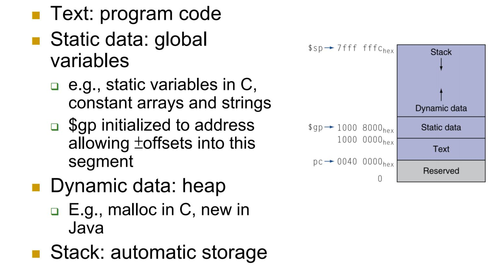
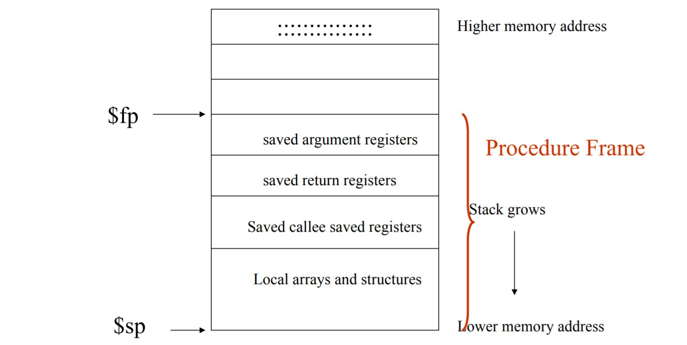
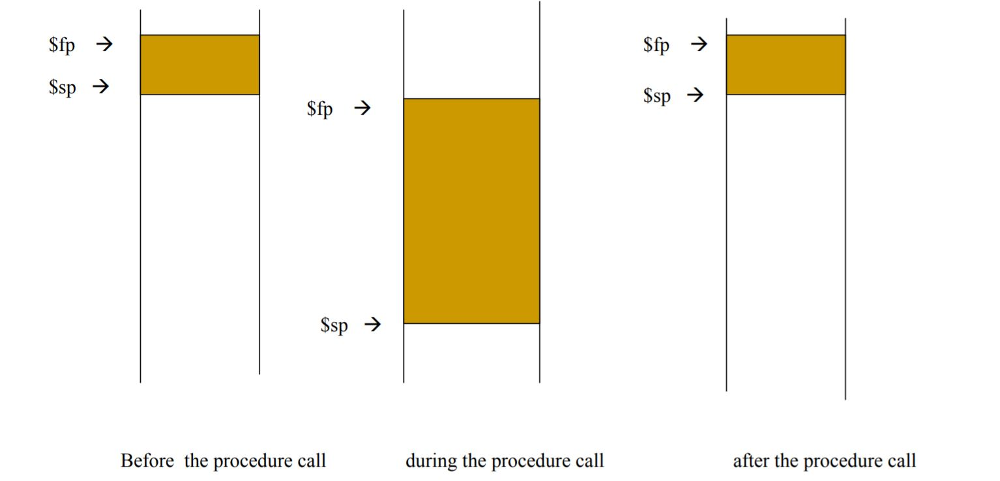
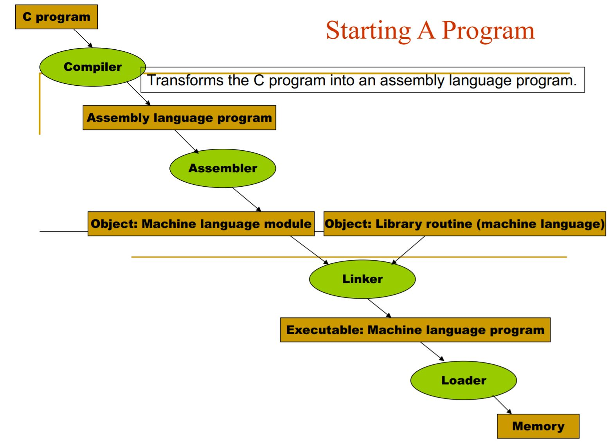
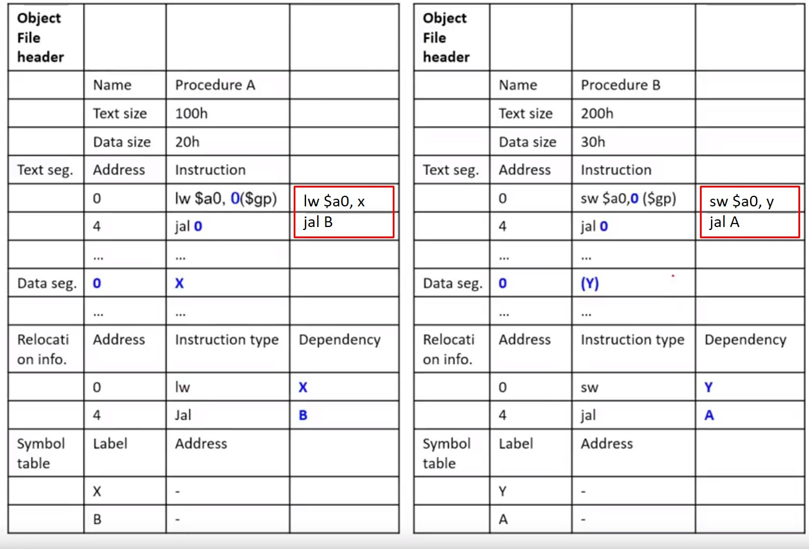
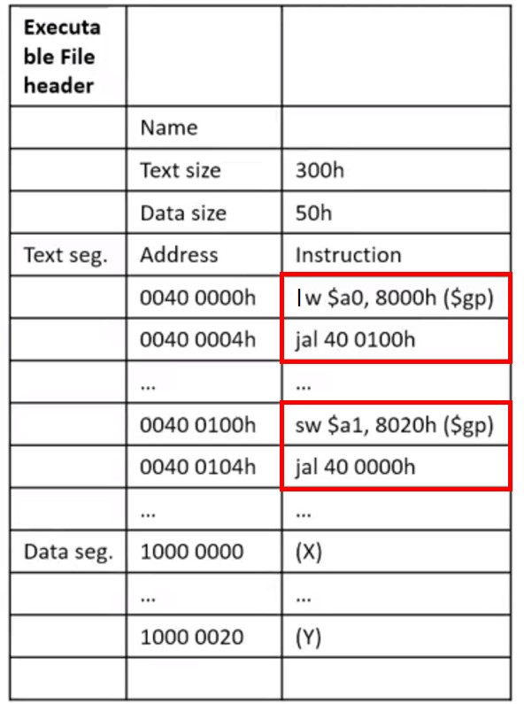
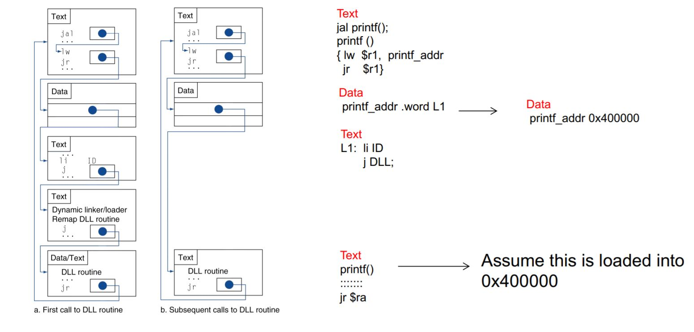

---
export_on_save:
  phantomjs: "pdf"
---

Computer Architecture Lecture 4

# Call(callee, caller)

-   caller: function making a call ( 呼叫 function 的一方 )
-   callee: function being called (被 call 的一方 )

## 決定 caller && callee 的 register

*   $\$a0$-$\$a3$: 四個 argument registers 傳遞參數，超過四個的話就用 stack (push and pop)
*   $\$v0$-$\$v1$: 兩個 value registers 來回傳結果

### caller && callee saves

|   Name    | Register number |                  Usage                   |              |
| :-------: | :-------------: | :--------------------------------------: | ------------ |
|   $\$zero$   |        0        |           the constant value 0           |              |
| $\$v0-\$v1$ |       2-3       | values for results && expression evaluation | caller saves |
| $\$a0-\$a3$ |       4-7       |                arguments                 | caller saves |
| $\$t0-\$t7$ |      8-15       |               temporaries                | caller saves |
| $\$s0-\$s7$ |      16-23      |                  saved                   | callee saves |
| \$t8-\$t9 |      24-25      |             more temporaries             | caller saves |
|    $\$gp$    |       28        |              global pointer              | callee saves |
|    $\$sp$    |       29        |              stack pointer               | callee saves |
|    $\$fp$    |       30        |              frame pointer               | callee saves |
|    $\$ra$    |       31        |              return address              | callee saves |

* caller saves: 由 Caller 負責清理或存入 stack frame

  * Caller 再呼叫 Callee 前，必須先將 caller-save register 的值存入 stack frame。
  * 所以 callee 便可直接使用 caller-save register 裡的值。

* callee saves: 由 Callee 負責清理或存入 stack frame

  * callee 要用 Callee-save register 前, 則需先 push 其值至 stack frame
  * 用完後再從 stack frame pop 回覆 Callee-save register 原來的值。
  * 所以對 Caller 而言，Callee-save register 的值，在 call 的前後應該是一致的。

### Use **Stack**

* Memory Layout





NOTE: $\$fp$ 和 $\$sp$ 都是 callee saves register, 所以呼叫 function 前後應該要如下圖。 



## How to switch control?

*   How to go to the callee

    *   ```assembly
        jal procedure_address # (jump and link)
        ```

    *   會把 return address (PC + 4 ) 存在 $ra 裡

    *   設置 PC = procedure_addres，然後跳轉到該位置

*   How to return from the callee

    *   Callee exectues `jr $ra`

## Procedure Calling Convention

*   in caller:
    1.  put arguments in $\$a0$ - $\$a3$ (準備傳遞的參數)
    2.  push $\$a0$ - $\$a3$ to stack(need in nested call)
    3.  push $\$t0$ - $\$t7$ to stack (if needed)
    4.  push $\$ra$ to stack (if needed in nested call)
    5.  jal Label (執行 jal instruction)

*   in callee:

    6.  `subi $sp, $sp <frame-size>`
        * stablish stack frame
    7.  push $\$ra$, $\$fp$, $\$s0 - \$s7$ to stack
        * saved callee saved registers
    8.  `Add $fp, $sp, <frame-size>-4`
        * establish frame pointer
    9.  DOOOOOOOOOOO SOMETHING in call
    10.  place return value in $\$v0$, $\$v1$
    11.  restore $\$ra$, $\$fp$, $\$s0 - \$s7$ with pop
    12.  `jr $ra`

# Array vs. Pointer

>   #### Example: which faster?
>
>   In Array
>
>   ```c
>   Clear(int array[], int size) {
>   	int i;
>   	for (i=0, i< size; i+= 1)
>   		array[i] = 0;
>   }
>   ```
>   In Pointer
>
>   ```c
>   Clear(int *array, int size) {
>   	int *p,
>   	for (p = &array[0]; p < &array[size]; p = p+1)
>   		*p = 0;
>   }
>   ```
>
>   ---
>
>   In Array, \# of Instruction per iteration = 6
>
>   ```assembly
>   	move $t0, $zero 		# i =0
>   Loop : 
>   	sll $t1, $t0, 2 		# I * 4
>   	add $t2, $a0, $t1 		# t2 = address of array[i]
>   	sw $zero, 0($t2) 		# array [i] = 0
>   	addi $t0, $t0, 1 		# i = i +1
>   	slt $t3, $t0, $a1 		# compare i and size
>   	bne $t3, $zero, loop
>   ```
>
>   In Pointer, \# of Instruction per iteration = 4
>
>   ```assembly
>   	move $t0, $a0 			# p = &array[0]
>   	sll $t1, $a1, 2 		# t1 = size x 4
>   	add $t2, $a0, $t1 		# t2 = &array[size]
>   Loop : 
>   	sw $zero, 0($t0) 		# memory[p] = 0
>   	addi $t0, $t0, 4 		# p= p+4
>   	slt $t3, $t0, $t2 		# compare p, & array[size]
>   	bne $t3, $zero, Loop
>   ```
>
>   Maybe pointer faster!

# Synchronization in MIPS

在 MIPS 中使用特殊的 Load/Store 操作 LL（Load Linked，連結載入）以及 SC（Store Conditional，條件存儲），來達成多執行緒程式設計，對共用變數的互斥訪問。

* LL 指令的功能是從記憶體中讀取一個字，以實現接續的 RMW（Read-Modify-Write） 操作；
  * `ll rt, offset(rs)`

  * >   當使用 LL d, offset(b)，處理器會記住 LL 指令的這次操作，同時 LL 指令讀取的位址 offset(b) 也會保存在處理器的暫存器中。


* SC 指令的功能是向記憶體中寫入一個字，以完成前面的 RMW 操作。
  * `sc rt, offset(rs)`

  * >   接在 ll 後面的 SC 指令，比如 SC t, offset(b)，會檢查上次 LL 指令執行後的 RMW 操作是否是 atomic 的（即不存在其它對這個位址的操作，值沒有改變）。並且 t 值會被更新成
    >
    >   1 且 t 的值將會被更新至記憶體中, if 是 atomic 的，表示操作成功；
    >
    >   0 且 t 的值不會被更新至記憶體中, if: 不是 atomic 的，表示操作失敗；
    >
    >   判斷 t 值，再決定接下來的動作，例如失敗就在回去執行 LL 指令。達到解決同步問題的目的 

  * SC指令執行失敗的原因有兩種：

    1.  在 LL/SC 過程中，發生了一個 interrupt，這些 interrupt 可能會打亂 RMW 操作的原子性。
    2.  在多核處理器中，一個核在進行 RMW 操作時，別的核試圖對同樣的位址也進行操作。


# MIPS Addressing Mode

## Immediate addressing

運算元是常數，且包裝在指令內部。

>   Ex: addi $\$2$, $\$3$, 4

## Register addressing

運算元是 register。

>   Ex: add $\$r1$, $\$r2$, $\$r3$

## Base addressing

運算元存放在記憶體中，而位址本身是暫存器和指令中常數的和。

>   Ex: lw $\$2$, 100($\$3$)

*   Method 1

```assembly
.data 			 # define prog. data section
	xyz: .word 1  # some data here
	… 			 # possibly some other data
.text 			 # define the program code
	… 			 # lines of code
	lw $5,xyz 	  # loads contents of xyz in r5
```

assembler 會自動把 `lw $5, xyz` 轉換成

```assembly
lw $5, offset($gp) # gp is register 28, the global pointer
```

Note : .data, .word, .text are assembler directives.

*   Method 2

或是把 Method 1 的轉換成

```assembly
la $6, xyz 		#r6 contains the address of xyz
lw $5, 0($6) 	#r5 contains the contents of xyz
```

*   Method 3: If the address is a constant

    *   use li, if less than ±32K ($2^{16}$ with 2's Complement)

    *   use lui(load upper immediate) and ori, if large than ±32K


> #### example: load 10101010101010101010101010101010 into register $t0
>
>  `10101010101010101010101010101010` large than 16 bits(32k), so use lui and ori:
>
>  `lui $t0, 1010101010101010`
>
> |           | 32-17            | 16-1             |
> | --------- | ---------------- | ---------------- |
> | 原本的 \$t0  | xxxxxxxxxxxxxxxx | xxxxxxxxxxxxxxxx |
> | immediate | 1010101010101010 | 0000000000000000 |
> | 運算後 \$t0  | 1010101010101010 | 0000000000000000 |
>
>  `ori $t0, $t0, 1010101010101010`
>
> |           | 32-17            | 16-1             |
> | --------- | ---------------- | ---------------- |
> | 原本的 \$t0  | 1010101010101010 | 0000000000000000 |
> | immediate | 0000000000000000 | 1010101010101010 |
> | 運算後 \$t0  | 1010101010101010 | 1010101010101010 |

## PC-relative addressing

位址是 PC 和指令中 immediate 的加總。

>   Ex: beq $\$2$, $\$3$, 100

## Pseudodirect addressing

跳躍位址是指令的 26 bits 再加上 PC 較高的 bits。

>   Ex: j 100

# Starting A Program



## Assembler

將 assembly language program 轉換成 object file

Symbol table: 儲存 Label 在 memory 中實際上的位置，方便做 link

Psudoinstruction: a common variation of assembly language instructions often treated as if it were an instruction in its own right.

>   #### Example: move $\$t0$, $\$t1$ -> add $\$t0$, $\$zero$, $\$t1$ or blt -> slt & bne 

## Linker (Link editor)

將多個 object file link 在一起，產生可以跑在電腦上的 executable file

有三個步驟:

1.  Place code and data modules symbolically in memory.(把 code(text) 和 data 先放好)
2.  Determine the addresses of data and instruction labels.( 設置 data 和 label 的位置)
3.  Patch both the internal and external references.( 將其他 references patch 進來 )

>   #### Example: generate executable file
>    
>
>   and \$gp = 10008000h
>
>   ---
>
>   1.  先把 code(text) 和 data 先放好，先放 procsdure A 在放 procsdure B，
>       放好後 Text size = 100h+200h = 300h, Data size = 20h+30h = 50h
>
>   2.  label X = 8000h($\$gp$), 8000h = (.data(x) addr) - $\$gp$ = 10000000h - 10008000h
>       label B = 400100h, 400100h = (400000h + 100h + 4h) - 4h
>       label Y = 8020h($\$gp$), 8020h = (.data(y) addr) - $\$gp$ = 10000020h - 10008000h
>       label A = 400000h, 400000h = (400000h + 0h + 4h) - 4h
>
>       >   jal target 的 target 計算上有 -4h 的部分是因為 PC 在執行 jal 時是 PC = PC + target, 然後在更新下一個 PC 值 PC = PC + 4, 所以全部會變成 PC = PC + target + 4
>
>   3.  Patch both the internal and external references.
>
>   


## Loader

讀 executables file header 來確定 text and data seg. 大小

依據獨到的大小建立一個足夠大的記憶體空間給程式

複製 instructions and data 到剛剛建立的記憶體空間裡面

複製 main program 的參數(如果有的話)到 stack 裡面

初始化 machine registers 和設置 stack pointer(\$sp)

跳至 start-up routine 的部分然後開始執行

### Dynamically Linked Libraries (DLL)

傳統的 statically linked library 缺點

*   Library 不好更新
*   會讀進全部的 Librar，但不是全部都會用到

所以有 Dynamically Linked Libraries 的出現

*   Libraries 在執行後才會 load and link
*   Lazy procedure linkage
    *   被 call 過一次才會 link


>   #### Example 
>
>   

