---
export_on_save:
  phantomjs: "pdf"
---

###### Computer Architecture Lecture 6-7

# Pipelining

* 不會改善單一 task 的 latency(執行時間)，而是改善全部 task 的 throughput(單位時間能完成多少量)
* 不同的 task 在同一時間使用不同的資源
* 會被最慢的 stage 所限制 （所以希望每個 stage 長度平均一點或降低速度）

## Pipelining in CPU

把 instruction 分割成較小的 steps，每個 steps 執行 1 clock cycle 的時間

*   cycle time 會等於時間最長的那個 step，為了讓每在個 step 的時間長度大致相同

在 MIPS 中分成五個 steps:

| 縮寫       | 敘述                                       |
| -------- | ---------------------------------------- |
| IF       | Fetch the instruction from the Instruction Memory |
| RF/ID    | Registers Fetch and Instruction Decode   |
| EXEC/ALU | Execution, Memory Address Computation, or Branch Completion |
| Mem      | Memory Access or R-type instruction completion |
| WB       | Write-back                               |


>   #### Example: Single Cycle vs. Pipeline
>
>   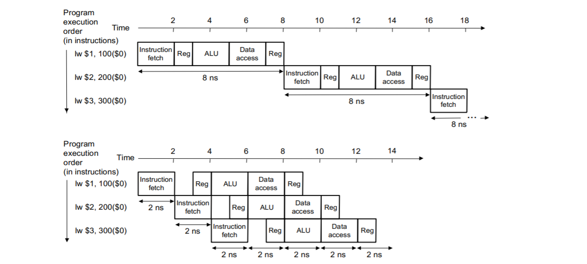
>
>   Time to execute **4** load instructions:
>
>   *   single cycle: $8(\text{instruction time}) * 4 = 32 ns$
>   *   pipeline: $8(${instruction time}) + 4 * 2(${cycle time}) = 16ns$

## Ideal Pipeline Performance

Ideal speedup from pipelining == # of pipeline stages

-   如果 step 時間長度分割的好，且 instruction 數量很大的話

$(instructions\; 總執行時間)_{\;pipeline} = \dfrac{(instructions\; 總執行時間)_{\;nonpipeline}}{\# \; of \; pipeline \; stages}$

## Graphically Representing Pipelines

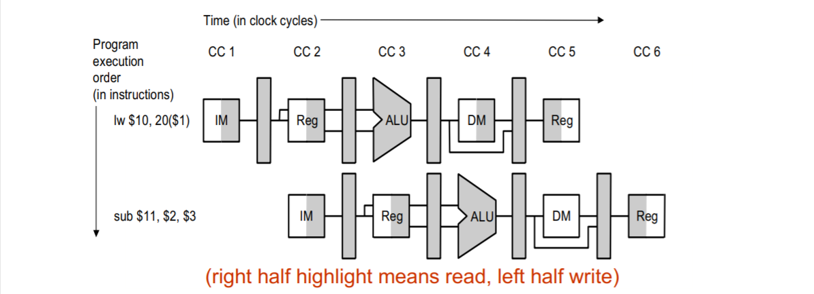

可以從圖片解決下列問題：

*   此 code 會有多少 cycle
*   在 cycle 4 的時候， ALU 在做什麼？
*   理解 datapath 目前走向

## A Pipelined Datapath

### Basic Idea: Split Single-cycle Datapath

 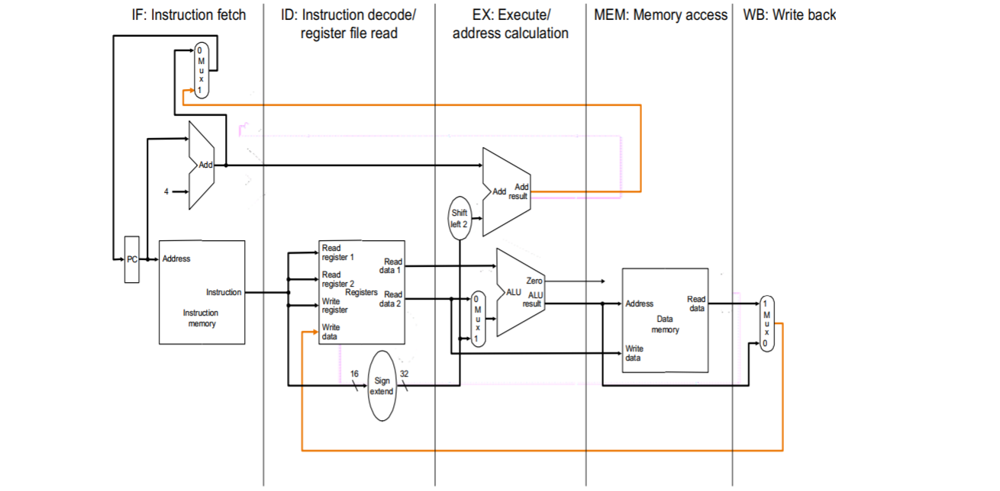

### Add Pipeline registers

 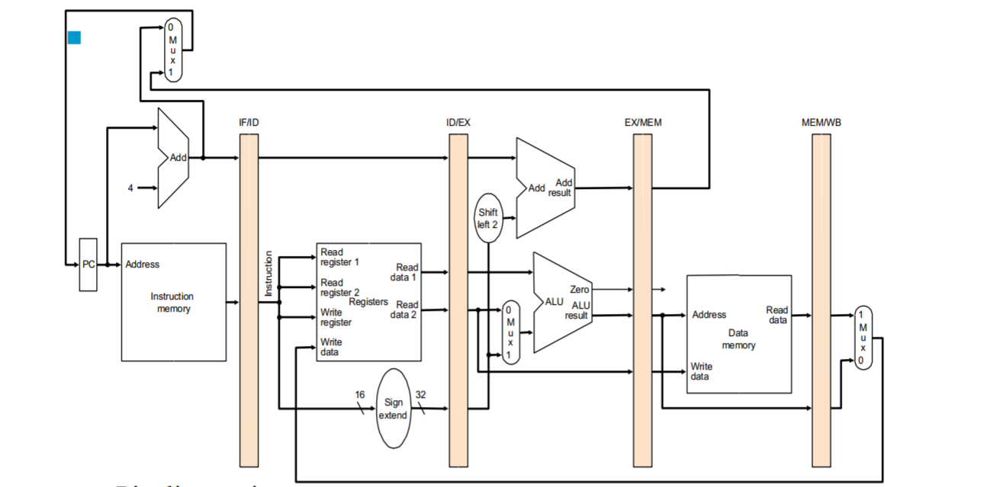
Pipeline registers

-   將需要傳給下一個 step 的 data 存起來
-   命名方式是將被分割的兩個 step 連在一起，MIPS 有 IF/ID、ID/EX、EX/MEM、MEM/WB 四個。
-   已經得到但還沒用到的資源也要繼續傳下去
    -   R-type 的 RT(write register) 要繼續傳下去，否則當第五個 step 結束要 write back 時會會不知道要寫到哪裡(要 WB 的時候，ID step 的部分已經在 decode 第三個 instruction 了)
    -   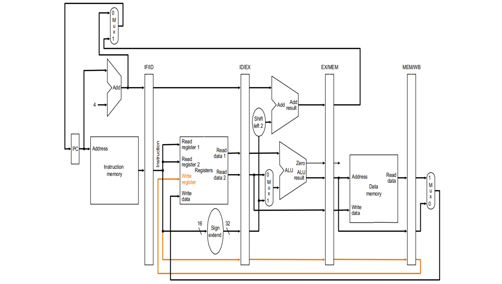

Control signal

-   根據使用的時間將 control signal 分類，用到的就可以不要了，沒用到但後面會用到的要繼續傳下去。也是為了避免 instrction 彼此混淆。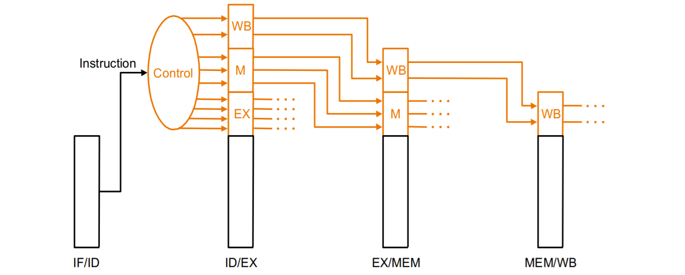

    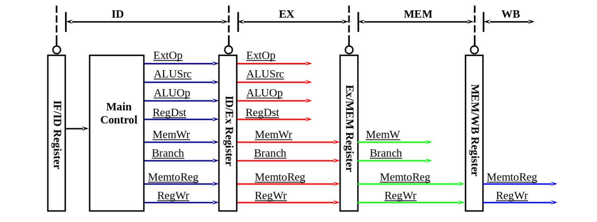

Datapath with Control

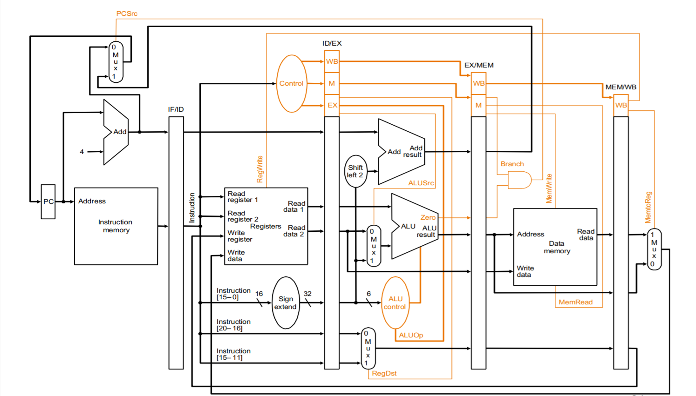

>   #### Example
>
>   ```assembly
>   lw  $10, 20($1)
>   sub $11, $2, $3
>   and $12, $4, $5
>   or  $13, $6, $7
>   add $14, $8, $9
>   ```
>
>   Cycle 1
>
>   >   IF step: 
>   >
>   >   IF/ID.IR = MEM[PC]; IF/ID.PC = PC + 4; PC = PC + 4;
>   >   (step 1 做的事情都一樣，後面就不再多打了)
>
>   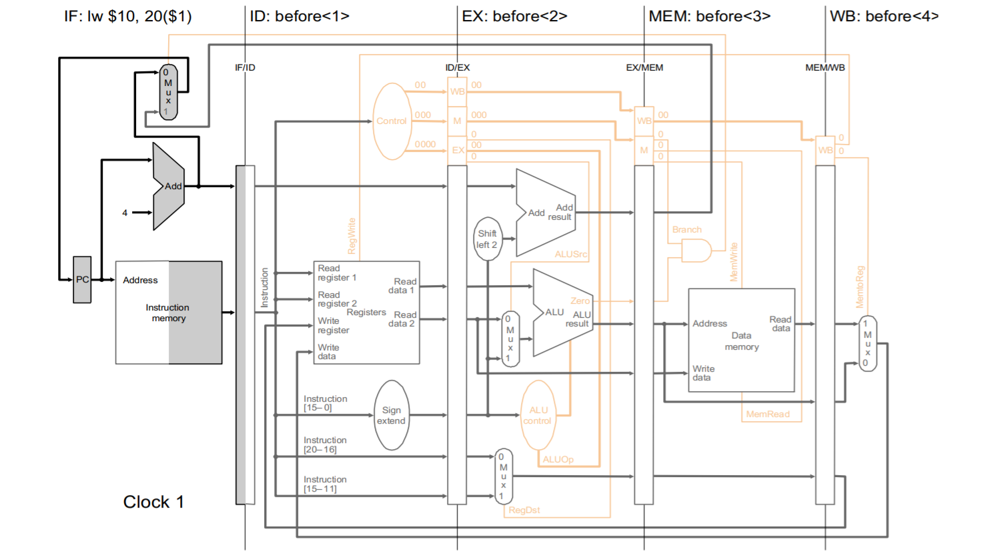
>
>   Cycle 2
>
>   >   ID step:
>   >
>   >   ID/EX.PC = IF/ID.PC;
>   >   ID/EX.A = Reg[IF/ID.IR[25-21]]; ($\$rs$)
>   >   ID/EX.Immediate = (sign-ext(IF/ID.IR[15-0]);
>   >   ID/EX.RT = IF/ID.IR[20-16]; ($\$rt$)
>
>   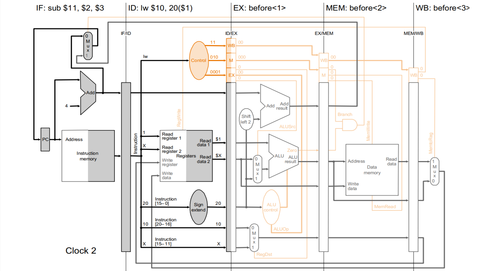
>
>   Cycle 3
>
>   >   EX step:
>   >
>   >   EX/MEM.PC = ID/EX.PC + (ID/EX.Immediate << 2);
>   >   Immediate = ID/EX.Immediate; (因為 ALUSrc = 1);
>   >   EX/MEM.ALUOut = ID/EX.A + Immediate; (因為 ALUOp== 00, L/S 加法)
>   >   EX/MEM.RT = ID/EX.RT; (因為 RegDst = 0)
>
>   >   ID step:
>   >
>   >   ID/EX.PC = IF/ID.PC;
>   >   ID/EX.A  = Reg[IF/ID.IR[25-21]]; ($\$rs$)
>   >   ID/EX.B  = Reg[IF/ID.IR[20-16]]; ($\$rt$)
>   >   ID/EX.RD = Reg[IF/ID.IR[15-11]]; ($\$rd$)
>
>   
>
>   Cycle 4
>
>   >   MEM step:
>   >
>   >   PC = PC; (因為 Branch and EX/MEM.Zero == 0)
>   >   MEM/WB.MemData = MEM[EX/MEM.ALUOut]; (因為 MemRead = 1 and MemWrite = 0)
>   >   MEM/WB.RT = EX/MEM.RT;
>
>   >   EX step:
>   >
>   >   EX/MEM.PC = ID/EX.PC + (ID/EX.Immediate << 2);
>   >   B = ID/EX.B; (因為 ALUSrc = 0);
>   >   EX/MEM.ALUOut = ID/EX.A - B; (因為 ALUOp == 10, funct 判斷為減法)
>   >   EX/MEM.RD = ID/EX.RD; (因為 RegDst = 1)
>
>   >   ID step:
>   >
>   >   ID/EX.PC = IF/ID.PC;
>   >   ID/EX.A  = Reg[IF/ID.IR[25-21]]; ($\$rs$)
>   >   ID/EX.B  = Reg[IF/ID.IR[20-16]]; ($\$rt$)
>   >   ID/EX.RD = Reg[IF/ID.IR[15-11]]; ($\$rd$)
>
>   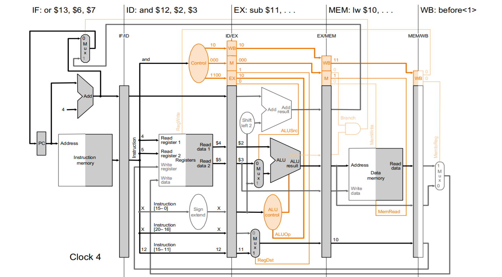
>
>   Cycle 5
>
>   >   WB step:
>   >
>   >   MemData = MEM/WB.MemData; (因為 MemtoReg = 1)
>   >   Reg[MEM/WB.RT] = MemData; (因為 RegWrite = 1)
>
>   >   MEM step:
>   >
>   >   PC = PC; (因為 Branch and EX/MEM.Zero == 0)
>   >   MEM/WB.ALUOut = EX/MEM.ALUOut; (因為 MemRead = 0 and MemWrite = 0)
>   >   MEM/WB.RD = EX/MEM.RD;
>
>   >   EX step:
>   >
>   >   EX/MEM.PC = ID/EX.PC + (ID/EX.Immediate << 2);
>   >   B = ID/EX.B; (因為 ALUSrc = 0);
>   >   EX/MEM.ALUOut = ID/EX.A and B; (因為 ALUOp == 10, funct 判斷為 and)
>   >   EX/MEM.RD = ID/EX.RD; (因為 RegDst = 1)
>
>   >   ID step:
>   >
>   >   ID/EX.PC = IF/ID.PC;
>   >   ID/EX.A  = Reg[IF/ID.IR[25-21]]; ($\$rs$)
>   >   ID/EX.B  = Reg[IF/ID.IR[20-16]]; ($\$rt$)
>   >   ID/EX.RD = Reg[IF/ID.IR[15-11]]; ($\$rd$)
>
>   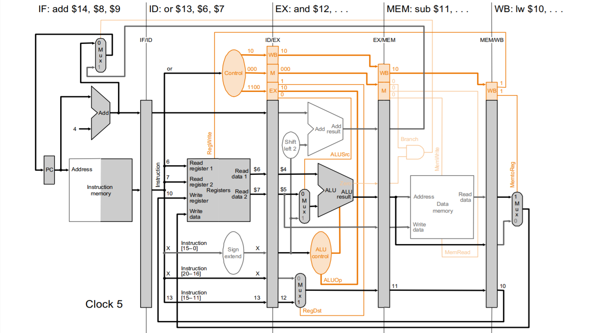
>
>   Cycle 6
>
>   >   WB step:
>   >
>   >   ALUOut = MEM/WB.ALUOut; (因為 MemtoReg = 0)
>   >   Reg[MEM/WB.RD] = ALUOut; (因為 RegWrite = 1)
>
>   >   MEM step:
>   >
>   >   PC = PC; (因為 Branch and EX/MEM.Zero == 0)
>   >   MEM/WB.ALUOut = EX/MEM.ALUOut; (因為 MemRead = 0 and MemWrite = 0)
>   >   MEM/WB.RD = EX/MEM.RD;
>
>   >   EX step:
>   >
>   >   EX/MEM.PC = ID/EX.PC + (ID/EX.Immediate << 2);
>   >   B = ID/EX.B; (因為 ALUSrc = 0);
>   >   EX/MEM.ALUOut = ID/EX.A and B; (因為 ALUOp == 10, funct 判斷為 or)
>   >   EX/MEM.RD = ID/EX.RD; (因為 RegDst = 1)
>
>   >   ID step:
>   >
>   >   ID/EX.PC = IF/ID.PC;
>   >   ID/EX.A  = Reg[IF/ID.IR[25-21]];($\$rs$)
>   >   ID/EX.B  = Reg[IF/ID.IR[20-16]];($\$rt$)
>   >   ID/EX.RD = Reg[IF/ID.IR[15-11]];($\$rd$)
>
>   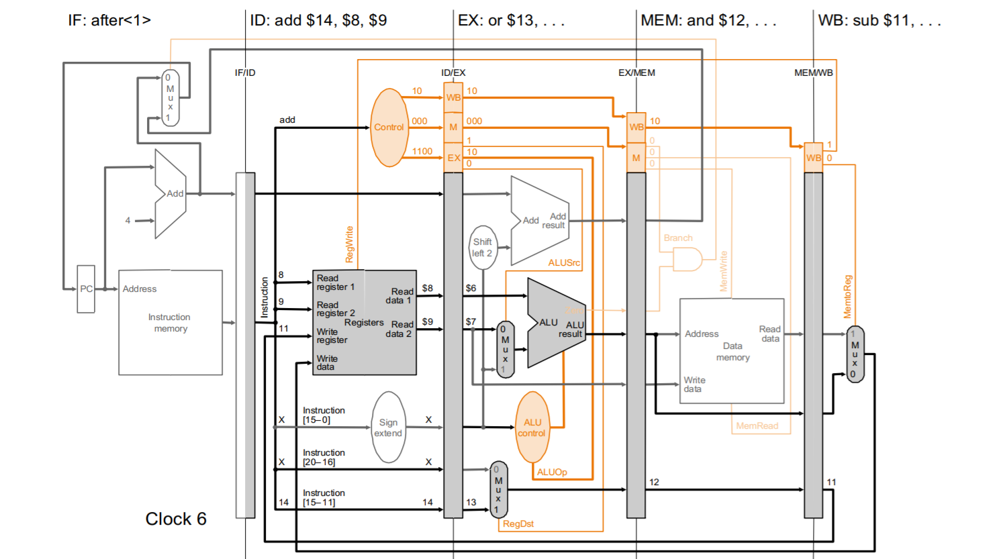
>
>   Cycle 7
>
>   >   WB step:
>   >
>   >   ALUOut = MEM/WB.ALUOut; (因為 MemtoReg = 0)
>   >   Reg[MEM/WB.RD] = ALUOut; (因為 RegWrite = 1)
>
>   >   MEM step:
>   >
>   >   PC = PC; (因為 Branch and EX/MEM.Zero == 0)
>   >   MEM/WB.ALUOut = EX/MEM.ALUOut; (因為 MemRead = 0 and MemWrite = 0)
>   >   MEM/WB.RD = EX/MEM.RD;
>
>   >   EX step:
>   >
>   >   EX/MEM.PC = ID/EX.PC + (ID/EX.Immediate << 2);
>   >   B = ID/EX.B; (因為 ALUSrc = 0);
>   >   EX/MEM.ALUOut = ID/EX.A and B; (因為 ALUOp== 10, funct 判斷為 and)
>   >   EX/MEM.RD = ID/EX.RD; (因為 RegDst = 1)
>
>   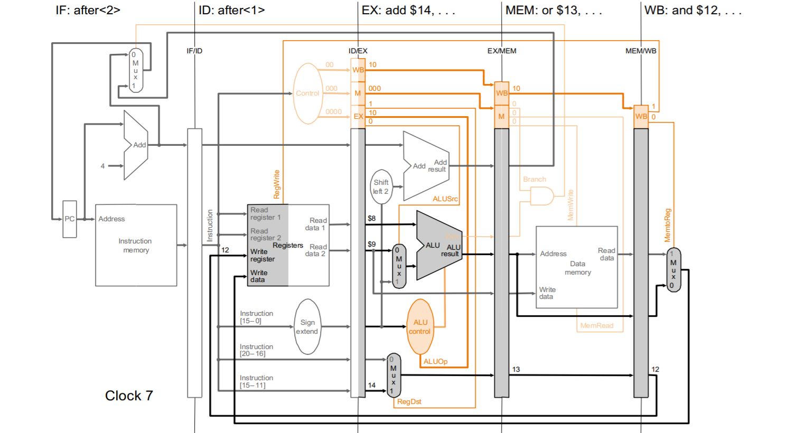
>
>   Cycle 8
>
>   >   WB step:
>   >
>   >   ALUOut = MEM/WB.ALUOut; (因為 MemtoReg = 0)
>   >   Reg[MEM/WB.RD] = ALUOut; (因為 RegWrite = 1)
>
>   >   MEM step:
>   >
>   >   PC = PC; (因為 Branch and EX/MEM.Zero == 0)
>   >   MEM/WB.ALUOut = EX/MEM.ALUOut; (因為 MemRead = 0 and MemWrite = 0)
>   >   MEM/WB.RD = EX/MEM.RD;
>
>   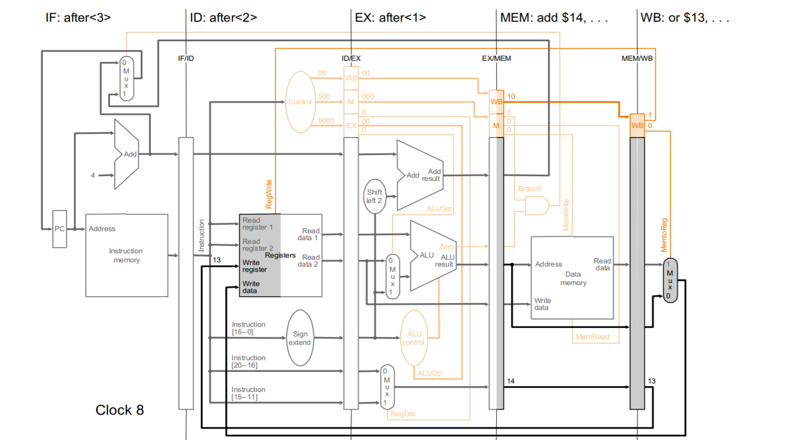
>
>   Cycle 9
>
>   WB step:
>
>   ALUOut = MEM/WB.ALUOut; (因為 MemtoReg = 0)
>   Reg[MEM/WB.RD] = ALUOut; (因為 RegWrite = 1)
>
>   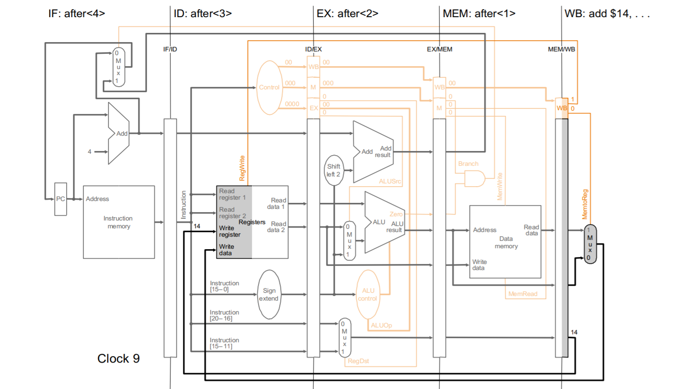

上面的例子大致上可以整理成如下：

Control Signal:

>   ID step:
>
>   ID/EX.Ctrl.WB = Ctrl.WB;
>   ID/EX.Ctrl.M  = Ctrl.M;
>   ID/EX.Ctrl.EX = Ctrl.EX;

>   EX step:
>
>   ALUSrc = ID/EX.ctrl.EX.ALUSrc;
>   ALUOp = ID/EX.ctrl.EX.ALUOp;
>   RegDst = ID/EX.ctrl.EX.RegDst;
>   EX/MEM.Ctrl.WB = ID/EX.Ctrl.WB ;
>   EX/MEM.Ctrl.M = ID/EX.Ctrl.M;
>   EX/MEM.Zero = Zero;

>   MEM step:
>
>   MEM/WB.Ctrl.WB = EX/MEM.Ctrl.WB;
>   Branch   = EX/MEM.Ctrl.M.Branch;
>   MemRead  = EX/MEM.Ctrl.M.MemRead;
>   MemWrite = EX/MEM.Ctrl.M.MemWrite;

>   WB step:
>
>   RegWrite = MEM/WB.Ctrl.WB.RegWrite;
>   MemtoReg = MEM/WB.Ctrl.WB.MemtoReg;

R-type(and, or ,add ,sub):

>   IF step:
>
>   IF/ID.IR = MEM[PC]; IF/ID.PC = PC + 4; PC = PC + 4;

>   ID step:
>
>   ID/EX.PC = IF/ID.PC;
>   ID/EX.A  = Reg[IF/ID.IR[25-21]]; ($\$rs$)
>   ID/EX.B  = Reg[IF/ID.IR[20-16]]; ($\$rt$)
>   ID/EX.RD = Reg[IF/ID.IR[15-11]]; ($\$rd$)

>   EX step:
>
>   EX/MEM.PC = ID/EX.PC + (ID/EX.Immediate << 2);
>   B = ID/EX.B; (因為 ALUSrc = 0);
>   EX/MEM.ALUOut = ID/EX.A and B; (因為 ALUOp == 10, funct 判斷 op)
>   EX/MEM.RD = ID/EX.RD; (因為 RegDst = 1)

>   MEM step:
>
>   PC = PC; (因為 Branch and EX/MEM.Zero == 0)
>   MEM/WB.ALUOut = EX/MEM.ALUOut; (因為 MemRead = 0 and MemWrite = 0)
>   MEM/WB.RD = EX/MEM.RD;

>   WB step:
>
>   ALUOut = MEM/WB.ALUOut; (因為 MemtoReg = 0)
>   Reg[MEM/WB.RD] = ALUOut; (因為 RegWrite = 1)

Load/Store:

>   IF step:
>
>   IF/ID.IR = MEM[PC]; IF/ID.PC = PC + 4; PC = PC + 4;

>   ID step:
>
>   Load:
>   ID/EX.PC = IF/ID.PC;
>   ID/EX.A = Reg[IF/ID.IR[25-21]]; ($\$rs$)
>   ID/EX.Immediate = (sign-ext(IF/ID.IR[15-0]);
>   ID/EX.RT = IF/ID.IR[20-16]; ($\$rt$)
>
>   Store:
>   ID/EX.PC = IF/ID.PC;
>   ID/EX.A = Reg[IF/ID.IR[25-21]]; ($\$rs$)
>   ID/EX.B = Reg[IF/ID.IR[20-16]]; ($\$rt$)
>   ID/EX.Immediate = (sign-ext(IF/ID.IR[15-0]);

>   EX step: 算 address
>
>   Load:
>   EX/MEM.PC = ID/EX.PC + (ID/EX.Immediate << 2);
>   Immediate = ID/EX.Immediate; (因為 ALUSrc = 1);
>   EX/MEM.ALUOut = ID/EX.A + Immediate; (因為 ALUOp== 00, L/S 加法)
>   EX/MEM.RT = ID/EX.RT; (因為 RegDst = 0)
>
>   Store:
>   EX/MEM.PC = ID/EX.PC + (ID/EX.Immediate << 2);
>   Immediate = ID/EX.Immediate; (因為 ALUSrc = 1);
>   EX/MEM.ALUOut = ID/EX.A + Immediate; (因為 ALUOp== 00, L/S 加法)
>   EX/MEM.B = ID/EX.B;

>   MEM step:
>
>   Load:
>   PC = PC; (因為 Branch and EX/MEM.Zero == 0)
>   MEM/WB.MemData = MEM[EX/MEM.ALUOut]; (因為 MemRead = 1 and MemWrite = 0)
>   MEM/WB.RT = EX/MEM.RT;
>
>   Store:
>   PC = PC; (因為 Branch and EX/MEM.Zero == 0)
>   WriteData = EX/MEM.B;
>   MEM[EX/MEM.ALUOut] = WriteData; (因為 MemRead = 0 and MemWrite = 1)

>   WB step:
>
>   Load:
>   MemData = MEM/WB.MemData; (因為 MemtoReg = 1)
>   Reg[MEM/WB.RT] = MemData; (因為 RegWrite = 1)
>
>   Store:
>   NOOP

Beq:

>   IF step:
>
>   IF/ID.IR = MEM[PC]; IF/ID.PC = PC + 4; PC = PC + 4;

>   ID step:
>
>   ID/EX.PC = IF/ID.PC;
>   ID/EX.A = Reg[IF/ID.IR[25-21]]; ($\$rs$)
>   ID/EX.B = Reg[IF/ID.IR[20-16]]; ($\$rt$)
>   ID/EX.Immediate = (sign-ext(IF/ID.IR[15-0]);

>   EX step: Compare A and B
>
>   EX/MEM.PC = ID/EX.PC + (ID/EX.Immediate << 2);
>   EX/MEM.zero = (ID/EX.A - ID/EX.B) == 0; (因為 ALUOp== 01, beq 減法)

>   MEM step:
>
>   Branch = 1 and if EX/MEM.Zero == 1 then PC = EX/MEM.PC

>   WB step:
>
>   NOOP

