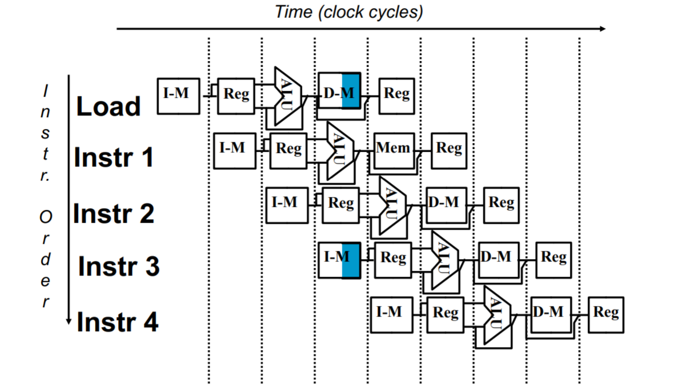
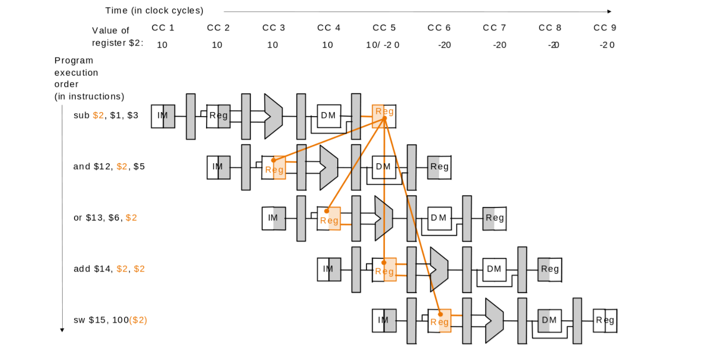
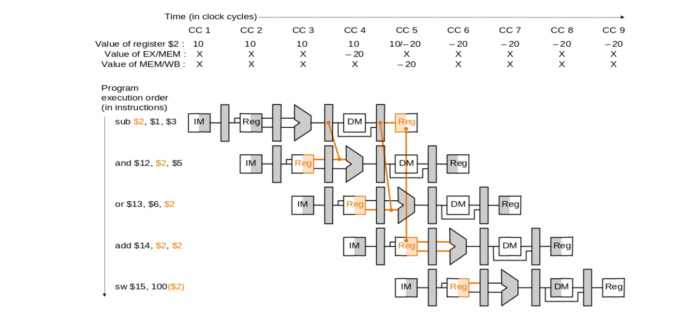
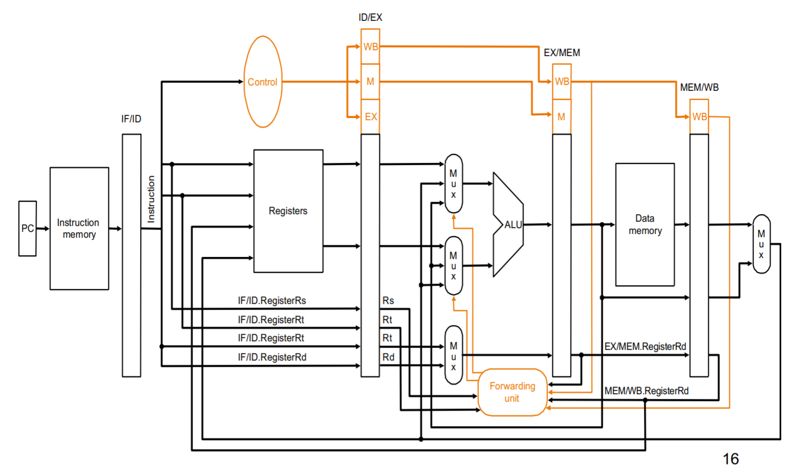
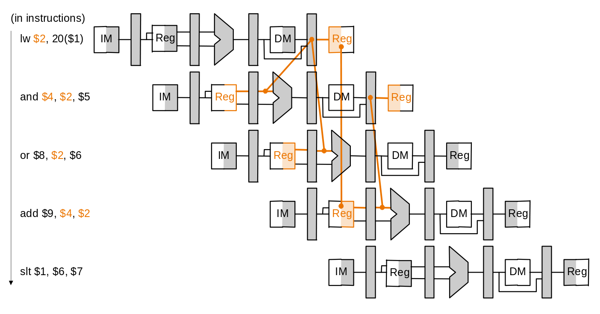
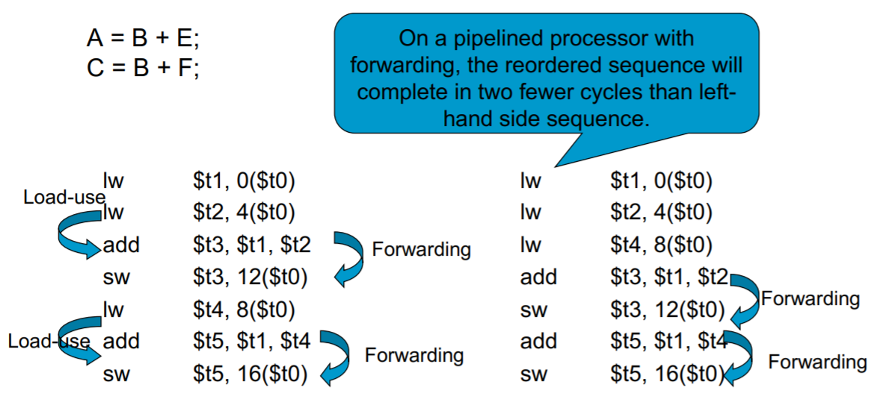
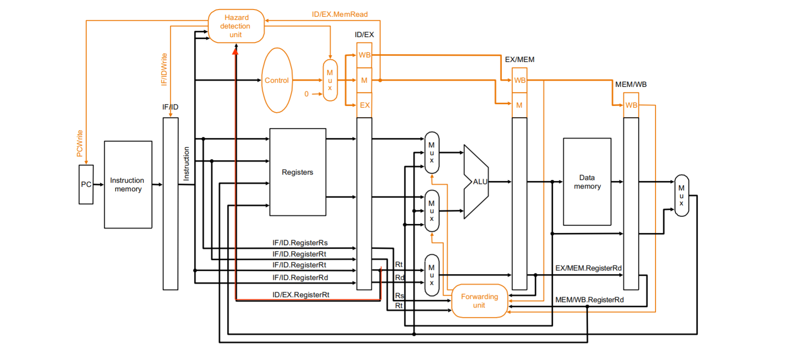
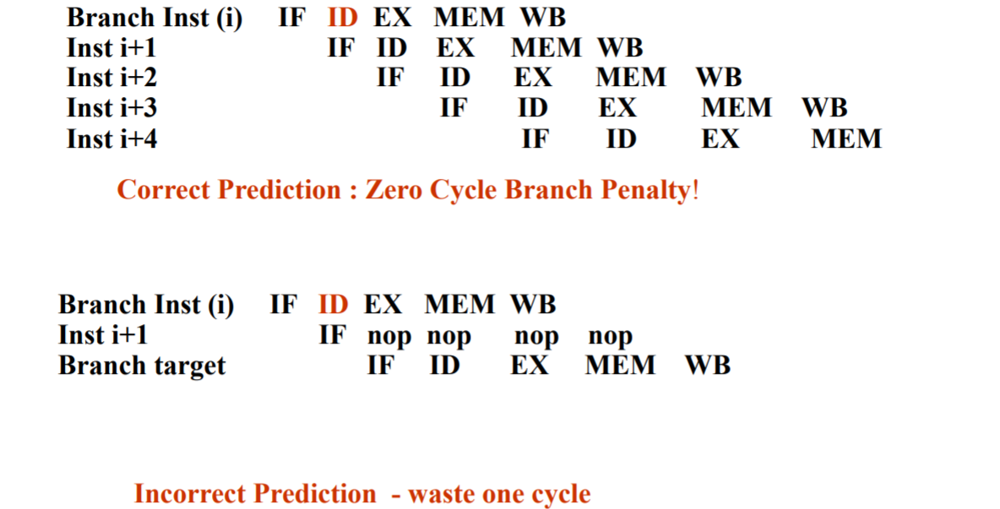
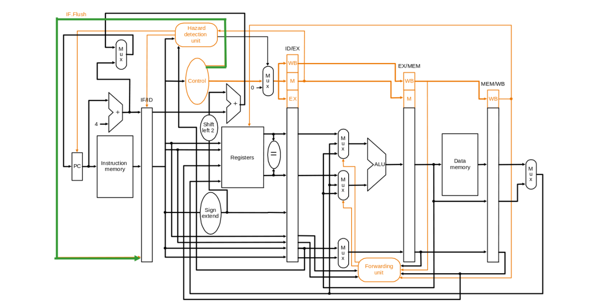

---
export_on_save:
  phantomjs: "pdf"
---

Computer Architecture Lecture 6-7

# Pipeline Hazards

不管是哪一種，只要 wait(stall, NOP) 就可以解決，就不再額外說明。

## Structure Hazard:

### 解釋：

不同的 instruction 同時想要去用同一個資源

### 解決方法：

1.  Wait 的方法會多出 1 個 cycle

2.  每個 intruction 要在相同的 stage 用特定的 resource

    例子：add 在第四個 stage 就已經算完可以準備 Write Back 了，但因為要避免和**前一個** instruction structure hazard，需要在第五個 stage 才能 write back。所以不能隨意跳過任一階段。

3.  把 instruction 和 data memory 分開

>   #### Example
>
>   
>
>   如果 instruction 和 data memory 沒分開的話，在 cycle 4 時會用到同一個 memory 資源，造成 structure hazard。(cycle 5 的 reg 分別是 write 和 read，不會互相干擾)

方法 2 和 3 是可以一起使用的，並非互斥。

## Data Hazard:

### 解釋：

上一個 instuction 還在處理欲使用的 data 或是還沒完成操作。有三種可能狀況會發生

1.  Read after Write: i2 在 i1 完成寫入之前讀
    *   看下面解決方法的例子會比較好懂。
2.  Write after Read: i2 在 i1 讀之前寫入
    *   MIPS 不會發生，因為 i1 先執行而且 read 都是在 step 2
3.  Write after Write: i2 在 i1 寫之前寫入
    *   MIPS 不會發生，因為 i1 早 i2 一個 step，而且 write 都是在 step 5

### 解決方法(只討論第一種)：

1.  #### Wait 的方法會多出 3 個 cycles

2.  #### Forwarding (R-type and R-type)

>   #### example
>
>   
>
>   在 cycle 5 `sub` 才將資料寫回 reg，但是 `and`, `or` 卻在之前就想要去 reg 拿資料。
>
>   
>
>   `sub` 在 ALU 就已經計算出結果了，而後面的 `and`, `or` 都不會改動到這個 \$2 的值，所以可以把 data forwarding 到 `and`, `or` 上，而 `add`, `sw` 沒有 Data Hazard 所以不用管。

##### Datapath with Forwarding:

有下面四種狀況，都表示正要讀取的 data 上一個 instruction 要寫入但還沒寫入

1.  EX/MEM.RegisterRd = ID/EX.registerRs or ID/EX.registerRt


2.  MEM/WB.RegisterRd = ID/EX.registerRs or ID/EX.registerRt


>   #### Example:
>
>   ```assembly
>   sub r2,  r1, r3
>   and r12, r2, r5 // 第一種狀況, sub 和 and
>   or  r13, r6, r2 // 第二種狀況, sub 和 or
>   ```

###### 有幾種狀況會影響 forwarding 順序:

1.  instruction 沒有要寫入 Reg => 檢查 RegWrite 是否被設置(或檢查是否為 1)
    * 原因非常簡單，要是一開始的 instruction 沒有要寫入，就不會有 Data Hazard (解釋的第一種狀況)
    * EX/MEM.RegWrite or MEM/WB.RegWrite

2.  要寫入的 Reg 是 $zero => 檢查 RegRd = 0
    *   $zero 不能被寫入，也不會改變其值，所以不用擔心會發生 Data Hazard
    *   EX/MEM.RegRd = $\$0$ or MEM/WB.RegRd = $\$0$

3.  mem 和 wb 都要 forwarding

    * 直接上範例，比較好解釋:
      ```assembly
      add $1, $1, $2;
      add $1, $1, $2;
      add $1, $1, $2;
      ```

      發生上述情形，要讓第二個 `add` 的 mem step 去 forwarding 給第三個 `add` ，才不會算出錯誤的值。

    * 所以在 wb 的階段要多判斷 Ex/MEM.RegRd != ID/Ex.RegRs or ID/Ex.RegRt

###### 上面的情況整理成如下的判斷式:

-   EX hazard:
    -   ```
        if ( 
            EX/MEM.RegWrite and 
            EX/MEM.RegRd != 0 and
            EX/MEM.RegRd = ID/EX.RegRs
        ) ==> ForwardA = (10)_2
        ```
    -   ```
        if (
            EX/MEM.RegWrite and 
            EX/MEM.RegRd != 0 and
            EX/MEM.RegRd = ID/EX.RegRt
        ) ==> ForwardB = (10)_2
        ```

-   MEM hazard:
    -   ```
        if (
            MEM/WB.RegWrite and
            MEM/WB.RegRd != 0 and
            MEM/WB.RegRd == ID/EX.RegRs and
            Ex/MEM.RegRd != ID/Ex.RegRs
        ) ==> ForwardA = (01)_2
        ```
    -   ```
        if (
            MEM/WB.RegWrite and
            MEM/WB.RegRd != 0 and
            MEM/WB.RegRd == ID/EX.RegRt and
            Ex/MEM.RegRd != ID/Ex.RegRt
        ) ==> ForwardB = (01)_2
        ```


###### 上述的 Forwarding 最快也只能:

1.  EX/MEM step 傳遞給**下一個** instruction 的 EX step
2.  MEM/WB step 傳遞給**下下個** instruction 的 EX step

###### Graphically:



3.  #### load-use (Load and R-Type)(wait + forwarding):

如果是 `load`，data 要在 MEM step 結束才能拿到，下一個 R-type 的 instruction 卻在 EX Step 開始就需要 data，而 forwarding 給下一個 instruction 最快也只能在 MEM/WB step 才傳給 EX step，會來不及。

而解法很簡單，就是先 stall 1 個 step 在 forwarding，稱為 load-use。



有時候我們要調換 code 的順序來減少 load-use 的情況發生(減少 wait stall 的情況)

>   #### Example
>
>   

方法 2 和 3 是可以一起使用的，並非互斥。

##### Datapath with load-use: 

要避免這種狀況，就會面臨以下幾個問題：

###### 怎麼偵測出是 load-use 的狀況？

1.  有設置 control signal 的 MEMRead 來從 Memory 讀出資料
    *   設置 MEMRead 訊號的話，就知道 data 至少要在 MEM step 才會讀出來知道其值。
2.  如果要寫入的 RegRt(I-type) 等於下一個 R-type instruction 的 RegRs 或 RegRt
    *   表示下一個 R-type instruction 需要使用還沒寫入的 data

滿足上述狀況，就會發生 load-use，所以可以寫成以下判斷式
```
if (
    ( ( ID/EX.MemRead )                                              ) and
    ( ( ID/EX.RegRt == IF/ID.RegRs) or (ID/EX.RegRt == IF/ID.RegRt ) )
) ==> stall the pipeline!
```
###### 怎麼 stall pipeline？

1.  IF/ID 再傳回去 IF/ID 裡(這樣在下一個 cycle 裡就會重新 decode 一次)
2.  把新的 ID/EX control signal 設為 0 (不讓後續的 step 繼續處理)
3.  把 PC 的 WriteEnable 設為 0 (PC 的不會更新，**重新讀入**下一個 instruction)

###### Graphically:



## Control Hazard:

### 解釋：

branch 類型指令在 step 3 (ALU)才知道要不要 branch，可是如果要 branch 前面已經先讀了 2 個錯誤的 instruction 了

### 解決辦法：

1.  Wait 的方法會多出 2 個 cycles (beq 在 ALU 就能得出 PC )

2.  Resolve branch earlier 早點決定

    假設我們有額外的硬體可以讓我們在 step 2(ID) 就計算好 branch 的位置。

    例如 Beq or Bne，多加一個 zero? 和 adder 在 step2，就可以提早判斷 

    不過這樣還是要 wait 1 個 cycle

3.  Predicted Untaken

    先預測不會 branch 走，再利用方法二在 step 2 提早決定，如果真的不會 branch 走，就繼續執行，會 branch 走，就當成是 wait 一個 cycle，並且把錯誤的 instruction flush 掉(把 IF/ID 設為 0 或把 control signal 設為 0)。

    成功預測，就不會浪費 cycle，失敗就是多出一個 cycle。

    提高命中率的方法 >> dynamic scheme (紀錄 predict 結果，後面會提到)



4.  load-use for branch:

    因為 branch 用方法二在 step 2 提早決定，在 step 2(ID) 就需要資料，相比 R-type 的 step 3(EX) 又在早了一個 step，所以會 stall 2 step 在 forwarding

##### Datapath with beq:

*   Flushing Instructions 的方法：

把 IF/ID 設為 0 (不讓下一個 instructions 繼續處理)



*   Dynamic Branch Prediction: Branch History Table

以 branch instruction 的 address (取最後 n 個 bit) 做索引，並儲存 branch taken(1) or not-taken(2) 的結果。如果猜錯的話就和之前一樣 flush 並修改 table。==> 需要 2^(n+1) bits 大小的 table

但是 1-bit 的 BHT 在 double loop 的結構下，外部迴圈每執行一次內部迴圈都會 predict 錯兩次，大大的提高錯誤率。==> 使用 2-bits BHT，兩次 predict 錯才改 table


>   #### Example
>
>   Branch outcome of a single branch: T T T N N N T T T
>
>   1.  在 1-bit  predictor 上，會有多少次預測錯誤？
>   2.  在 2-bits predictor 上，會有多少次預測錯誤？
>
>   ---
>
>   1.  2 次
>   2.  4 次

但就算猜對，還是要算出 target address，所以在 branch taken 時會有一個 cycle 的 penalty。
解決的方法是新增 buffer 存放 branch target address。

