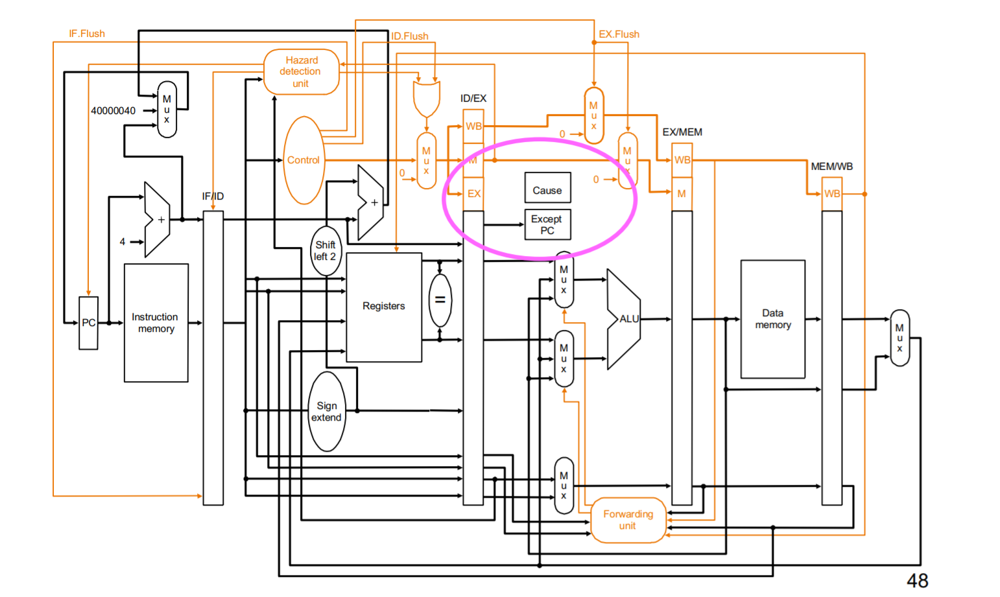
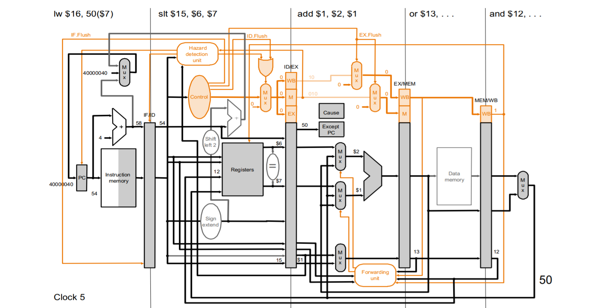
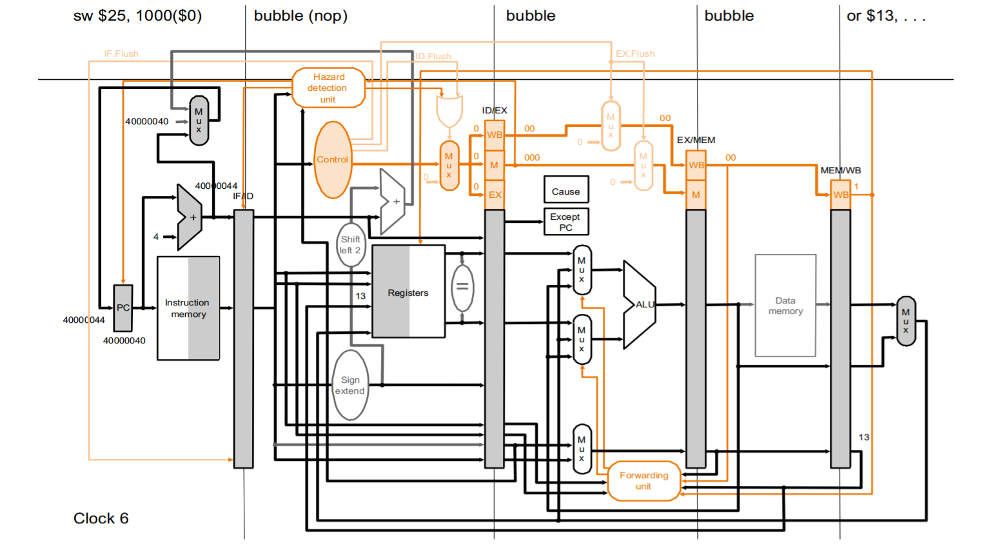
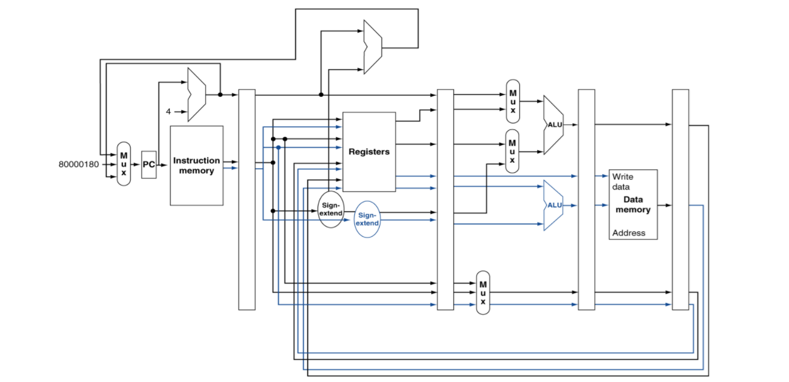
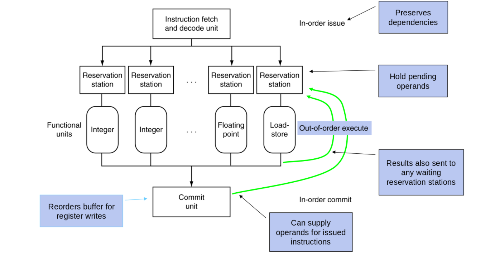
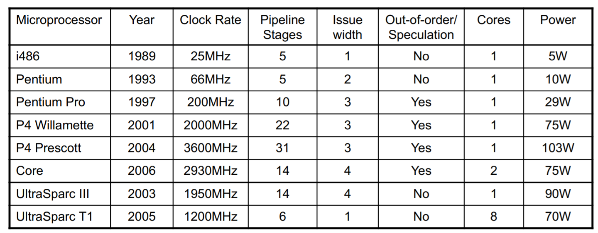

---
export_on_save:
  phantomjs: "pdf"
---

Computer Architecture Lecture 6-7

# Exception

非預期會發生的事件，大致上分為兩種：

1.  exception: 在 CPU 內部發生的(syscall，未定義的opcode，或overflow處理等等)
2.  interrupt: 從外部的 I/O 產生的

## Handling exception

1.  把在 IF, ID and EX stages 的 instruction Flush
2.  把這些違例或是被干擾的 instruction 的 PC(實際上是PC+4)存在 Exception program counter( EPC )
3.  問題的跡像(indicator)也存起來，在 MIPS 中是使用 Cause register
4.  如果能的話，先完成之前的指令
5.  然後再跳到 handler(PC = 0x40000040)
6.  Handler 先讀看原因(indicator)然後再轉至專門解決此類問題的handler，然後決定該採取什麼行動
    1.  如果是 restartable(可以重跑)，就用EPC回到原本執行的地方(EPC-4)，並採取判斷正確的行動
    2.  否則就終止程序並根據 EPC cause 來回報錯誤。

## Exception DataPath



>   #### Example:
>
>   Show what happens in the pipeline if an overflow exception occurs in the add instruction. 
>
>   ```assembly
>   sub $11, $2, $4 # 40hex 
>   and $12, $2, $5 # 44hex
>   or $13, $2, $6  # 48hex
>   add $1, $2, $1  # 4Chex
>   slt $15, $6, $7 # 50hex
>   lw $16, 50($7)  # 54hex
>   ```
>
>   ```assembly
>   sw $25, 1000($0) # 40000040hex
>   sw $26, 1004($0) # 40000044hex
>   ```
>
>   ---
>
>   
>
>   在 clock 5:
>
>   1.  `add` 在 EXE stage 偵測到 overflow
>   2.  存 PC+4 (50 hex) 到 EPC
>   3.  設置 IF.Flush, ID. Flush, 和 EX.Flush
>
>   
>
>   在 clock 6:
>
>   1.  fetch handler PC(0x40000040)，fetch `sw`
>   2.  完成在 `add` 之前的 instruction

# Instruction-Level Parallelism (ILP)

## multiple pipelines

### Instruction Per Cycle (IPC)

因為 CPI < 1，所以改用 IPC

### Speculation

先去猜測要做什麼，如果做錯了再從頭來過。(要猜才能盡量的讓 pipeline 滿)

-   猜對了 就繼續完成這個 instruction
-   猜錯了 就 roll-back 然後去跑正確的

比如:

-   branch 的時候就先猜 taken or not taken
-   `load` 先拿原有的位址去 load
    -   因為不太可能先 store 之後又馬上 load 某個資料
    -   所以就把 load 先做，因為 load 比較花時間，如果真的發生了再 roll back

#### Compiler 可以重新排列 instructions

比如:

*   branch 之前的 load 移到更早，避免 stall
*   加寫一些 instruction(fix-up) 來修正做出猜測錯誤的 speculation 狀況
*   增加用來延遲 exception 的 ISA

#### Hardware 可以做 look-ahead，提早計算結果

先將結果和 exception 都先存在 buffer 裡，直到他們要被用到或是判斷 speculation 正確。
如果 speculation 猜測錯誤就把 buffer flush 掉。

### 又分為 static 和 dynamic。

## Static: 

*   compiler 把要**同時執行**的 instruction 包成一包一包的 issue packets。
    *   可以把 packet 想成一個非常長的 instruction 裡面有好幾個同時運作的 operations。
    *   這樣的概念叫做VLIW(very long instruction word)
*   Compiler 要偵測避免 hazard
    *   把 instruction 重新排列並包成 issue packets 時避免會造成 hazard 的順序
    *   同個 packets 裡，同時在跑的 instruction 要互相獨立，不然就會搶資源或造成data hazard
    *   在不同的 packets 之間，可以有 dependency，但這部份根據不同的 ISA 會有不同的設計。
    *   有時候要放入 nop (不做任何動作)

### MIPS with static dual issue

一個 packet 有兩組 instruction。

*   一個只做 load/store 一個只做 ALU/branch，
*   所以只要加一個 ALU 和一個 sign extender 就可以實做。
*   64-bit aligned(兩個 instruction 合併)
    *   先 ALU/branch 在 load/store
    *   Pad an unused instruction with nop

#### DataPath:

Rigister 變成 4 個 read port 兩個 write port，多一個 ALU



#### EX data hazard:

```assembly
add $t0, $s0, $s1
load $s2, 0($t0)
```

把這兩個指令拆開放在兩個不同的 packets，就像stall一樣

#### Load-use hazard

*   一樣會造成一個 cycle 的延遲，但是一個 cycle 變成影響兩個instructions。
*   需要把指令做更好的排程(aggressive scheduling)

>   #### Example
>
>   Schedule this for dual-issue MIPS
>
>   ```assembly
>   Loop:
>   	lw    $t0,  0($s1)          # $t0=array element
>   	addu  $t0,  $t0,    $s2     # add scalar in $s
>   	sw    $t0,  0($s1)          # store result
>   	addi  $s1,  $s1,    –4      # decrement pointer
>   	bne   $s1,  $zero,  Loop    # branch $s1 != 0
>   ```
>
>   |       | ALU/branch             | Load/store       | cycle |
>   | ----- | ---------------------- | ---------------- | ----- |
>   | Loop: | nop                    | lw \$t0, 0(\$s1) | 1     |
>   |       | addi \$s1, \$s1,–4     | nop              | 2     |
>   |       | addu \$t0, \$t0, \$s2  | nop              | 3     |
>   |       | bne \$s1, \$zero, Loop | sw \$t0, 4(\$s1) | 4     |
>
>   IPC = 5/4 = 1.25 (c.f. peak IPC = 2)
>
>   可以觀察到 `lw` 會發生 load-use 的情況，所以把後面的 `addi` 先調到前面執行，在執行 `addu`
>
>   `addu` 和 `sw` 會有 data hazard 的狀況，只要 forwarding 就可以解決

#### loop unrolling:

* 一次完成多個 loop 的內容來減少 loop-control overhead(bne)
* 每一份 replicate 就是原本的 loop 跑一次
* 用不同的 register 來存放每一份 replicate 的結果
  * 稱為 register renaming
  * 避免 loop 裡面有 anti–dependencies(aka. name dependency): write-after-read
    * 多個 instruction 用到同樣的 register 來存資料但是彼此之間並沒有資料互相流通使用

>   #### Example:
>
>   Before: IPC = 5/4 = 1.25  ( for(load -> 計算 -> save) )
>
>   |       | ALU/branch             | Load/store       | cycle |
>   | ----- | ---------------------- | ---------------- | ----- |
>   | Loop: | nop                    | lw \$t0, 0(\$s1) | 1     |
>   |       | addi \$s1, \$s1,–4     | nop              | 2     |
>   |       | addu \$t0, \$t0, \$s2  | nop              | 3     |
>   |       | bne \$s1, \$zero, Loop | sw \$t0, 4(\$s1) | 4     |
>
>   After: IPC = 14/8 = 1.75  ( for(load) + for(add) -> for(save) )
>
>   |       | ALU/branch                    | Load/store                | cycle |
>   | ----- | ----------------------------- | ------------------------- | ----- |
>   | Loop: | addi \$s1, \$s1,–16           | lw **\$t0**, 0(\$s1)      | 1     |
>   |       | nop                           | lw **\$t1**, **4**(\$s1)  | 2     |
>   |       | addu **\$t0**, **\$t0**, \$s2 | lw **\$t2**, **8**(\$s1)  | 3     |
>   |       | addu **\$t1**, **\$t1**, \$s2 | lw **\$t3**, **12**(\$s1) | 4     |
>   |       | addu **\$t2**, **\$t2**, \$s2 | sw **\$t0**, **4**(\$s1)  | 5     |
>   |       | addu **\$t3**, **\$t3**, \$s2 | sw **\$t1**, **8**(\$s1)  | 6     |
>   |       | nop                           | sw **\$t2**, **12**(\$s1) | 7     |
>   |       | bne \$s1, \$zero, Loop        | sw **\$t3**, **16**(\$s1) | 8     |
>
>   IPC 從 1.25 提升到 1.75(更接近 2)，不過 code 和 register 也變得更大。

## Dynamic:

通常在超大型處理器中使用。

CPU 每個 cycle 會決定 issue 的對象。

*   以幫助 cpu 對 code 的語義有更好的掌握
*   compiler 做的事變少 CPU 更直接掌握 code 在做什麼

### Dynamic Pipeline Scheduling

讓 cpu 可以不照順序執行 instruction 以避免 stall

但是會把資料**照順序存回** register (比如說在stall的時候就先處理無關的instruction)

>   #### Example:
>
>   ```assembly
>   lw 	 $t0, 20($s2)
>   addu $t1, $t0, $t2
>   sub  $s4, $s4, $t3
>   slti $t5, $s4, 20
>   ```
>
>   Can start sub while addu is waiting for lw

### Dynamically Scheduled CPU

運作方式跟一般的pipeline有些出入，可以分為 4 個stage

1.  IF/ID: 照順序做完 instruction fetch 和 decode (這邊的動作很快)

2.  reservation stations: 控制哪些 instruction 要先 pending
    控制哪些instruction要先pending

3.  functional units 做不同的功能 – 整數運算, 浮點數運算, load-store…

    完成後把資料給 commit unit 及相對應在 pending 等這個結果的 reservation station

4.  commit unit:

    重新排列 register write 要用的 buffer，並提供 operands 給某些在 reservation pending 的 function。(類似之前單 issue 裡要 flush 重做的 function)

* Reservation station 和 commit unit 在 reorder buffer 時，自動達到了register renaming。


* 當一個 instruction 被 issue 到 reservation station 的時候，如果 instruction 的 operands 在 register 或 reorder buffer 裡可以被找到也可以被存取的話，把它複制到 reservation station，並且標明那個 register 已經無用可以被複寫。如果 operands 無法存取(unavailable)的話，有一個 function unit 會把該給的值給 reservation unit，而 register 裡面的值需不需要更新就要看指令。

* dynamically scheduled 的 speculation:

  在 branching 的結果確認之前不要 commit。而 speculation 一樣可以用在減少 load 和 cache miss delay。根據預測的 address 先取出值然後等 store 有沒有更改到這個 load 的 address，store 會把那個 address bypass 到 load unit。沒問題就把結果送到 commit unit，有問題就重做。




### Why Dynamically scheduling

1.  不是所有的 stall 都是可以從 code 裡看出來的

    比如: cache miss。

2.  branch 的結果也不能靠 scheduling 來解決。

    Branch outcome is dynamically determined

3.  不同的 ISA 有不同的延遲和不同的 hazard，都要交給 compiler 來處理實在非常麻煩。

### Multiple issue 的效能：

* 程式內有 dependency 會限制 ILP(instruction level parallelism)
  * 有些 dependency 很難去除，如 pointer aliasing (不同的名字的 pointer 指到同一個地方)
* 有一些平行也很難做到比如說IF/ID的部份


* memory 還有 delay 而且也有他的頻寬，也導致 pipeline 常常有 nop


* Speculation 如果做的好的話可以改善以上原因引起的 performance 下降
* 多顆簡單的核心(沒 speculation, issue width低, pipeline, stage 少)可以達到省電的作用
  * 因為 Complexity of dynamic scheduling 和 speculations 需要更多的電


