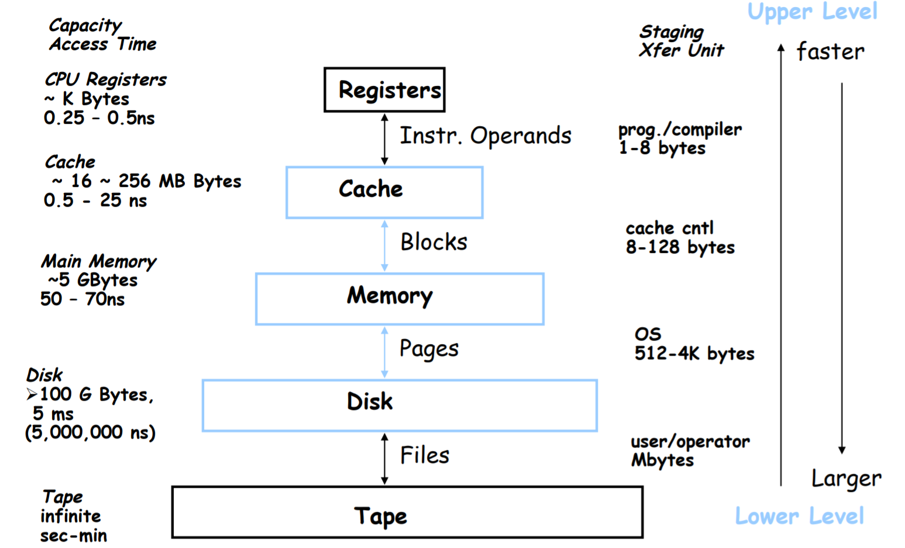
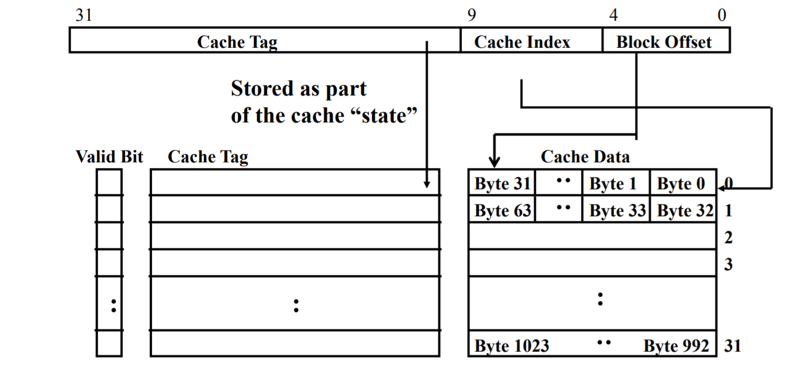
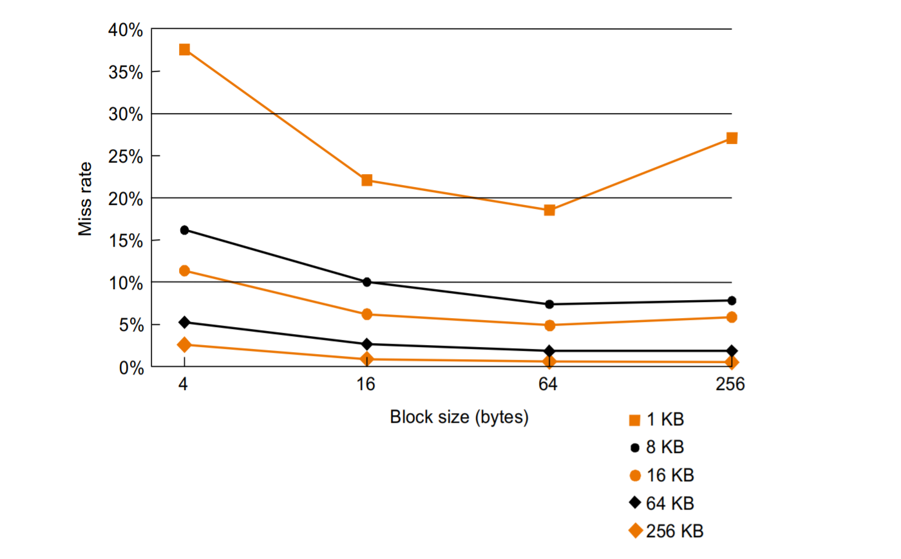
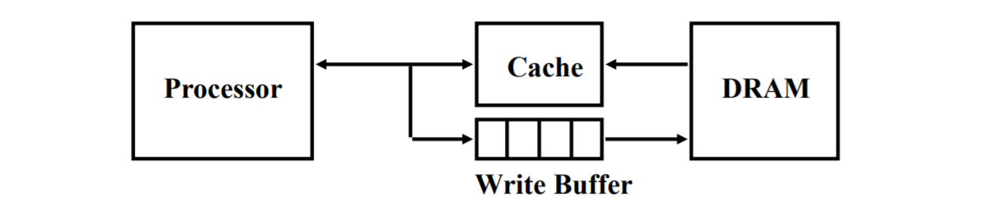
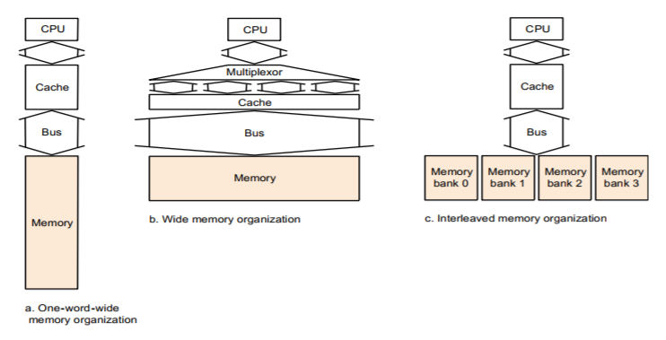
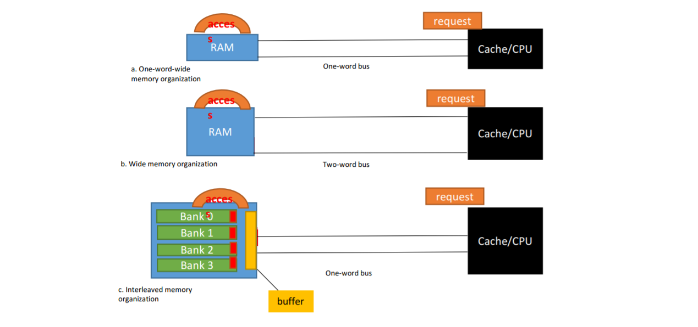

---
export_on_save:
  phantomjs: "pdf"
---

Computer Architecture Lecture 8

# Memory Hierarchy

主旨：愈常用的放在愈快拿到的地方

## Terminology

資料的 copy 以 block 為最小單位。

* Levels: 越上面的 level 越靠近 processor，也越小越快，但一單位的價格比較貴

* Inclusive: 上面有的資料，下面也要有

* Hit: 資料出現在上面的層級的 block 裡
  * Hit Rate: 資料在上層找到的機率
  * Hit Time: RAM access time + Time to determine hit/miss

* Miss: 資料**沒**出現在上面的層級的 block 裡，需要往下找資料
  * Miss Rate: 1 - (Hit Rate)
  * Miss Penalty: 置換上層 block 的時間 + 傳送 block 到 processor 的時間

* Hit time << Miss penalty

## General Principle

### using the principle of locality:

-   program access a relatively small portion of the address space at any instant of time
-   90/10 rule: 10% of code execute 90% of time

### two different types of locality

1.  Temporal locality: 最近被存取過的data容易再被存取

    Ex:在 loop 裡面的程序，或是在 loop 裡面一直被重複操作的數字

    讓越常被使用的資料越靠近 processor

2.  Spatial locality: 位址接近最近被存取過的data較有可能被存取，如 array

    將目標資料鄰近的資料一起裝進 loack 送往上層

# Caches 

## Direct mapped cache

### index:

*   實際 address 去 mod 餘 1, mod 餘 2 … 各放在同一個 cache block

cache addr 由 tag + index + offset 組成，用來找 cache 裡面的資料

### 在 cache 裡要儲存 valid bit + tag + data

#### tag:

*   紀錄 memory address 前面的幾個 bit
*   可知道資料原本在記憶體的位置

#### Valid bit:

-   紀錄 cache 內是否為有效資訊
-   1 = present, 0 = not present
-   initially 0，因為處理器剛啟動時，內容全部是無效的

>   #### Example 1
>
>   How many total bits are required for a direct-mapped cache with
>
>   16 KB of data and 4-word blocks, assuming a 32-bit address?
>
>   4-word = 4 * 4 bytes = 16b
>
>   1.  \# of sets: = $\dfrac{16 \; kb}{16 \; b} = 2^{10}$
>   2.  \# of data bits for each set: = $16 \; b = 2^4$  4 bits
>   3.  \# of tag bits for each set: = 32 - 10 - 4 = 18 bits
>   4.  Valid bit for each set: = 1 bits
>   5.  total cache bits: = $\# \; of \; sets * (Valid \; bit + tag \; bits + data \; bits) = 23 * 2^{10}$

>   #### Example 2
>
>   Consider a cache with 64 blocks and a block size of 16 bytes. What block number does byte address 1200 map to?
>
>   Block address = int(1200/16) = 75
>   Block number = 75 mod 64 = 11

### block size

-   因為有 spatial locality，所以希望一次可以搬好幾個 word 進來，也就是希望 block size 要大一點

-   不過 cache 的大小固定時，block size 變大，block number 就會減少，更多資料會 map 到同一個位置，miss rate 會增加

-   block size 變大時，miss penalty 也會增加(需要更長時間來填好整個 block)

    -   解決 miss penalty 上升:
    -   Early restart：正常運作，只要一 fetch 到需要的 word，就馬上把這個 word 送到 CPU
    -   Critical word first：先 fetch 需要的 word，再把剩下的 word 填進 cache block

    

## Handling Cache Misses

Cache **hit**, CPU 繼續正常處理

but cache **miss**

*   Stall the entire pipeline & fetch block from next level hierarchy

### instruction cache miss

*   Send the original PC value (PC-4) to the memory.
*   Instruct main memory to perform a read and wait for the memory to complete its access.
*   Write the cache entry, putting the data from memory in the data portion of the entry, writing the upper bits of the address (from the ALU) into the tag field, and turning the valid bit on.
*   Restart the instruction execution at the first step, which will refresh the instruction, this time finding it in the cache.

### Handling Writes

-   Write through：寫入 cache 時，同時也寫入 memory
    -   Good: read misses cannot result in writes & data coherency
    -   Bad: write stall
-   Write back：cache 被代替時，再寫入 memory，設 dirty bit
    -   Good: no repeated writes to same location
-   使用 write buffer：只有在 write buffer 滿的時候才 stall
    -   Processor: 將 buffer 的 block 寫入 cache 和 write buffer
    -   Memory controller: 將 buffer 的 block 寫入 memory
    -   FIFO and Typical number of entries = 4
    -   當 Store frequency << 1 / DRAM write cycle 時，運作最好
        -   但 Store frequency > 1 / DRAM write cycle 或 Write buffer 飽和時不好

### Write Miss Policy

-   Write allocate(fetch on write): 先 load 到 cache 再修改
-   No Write allocate(write around): 直接 write 底層的資料，不 load 到 cache
-   在做初始化時，寫入的資料(全都是0)不會在近期內就被讀取，採取 write around 就是一個比較好的選擇

| Hit            | Write through   | Write back            |
| -------------- | --------------- | --------------------- |
| Write allocate | 寫入 cahce/memory | 寫入 cahce; 設 dirty bit |
| Write around   | 寫入 cahce/memory | 寫入 cahce; 設 dirty bit |

| Miss           | Write through                     | Write back                              |
| -------------- | --------------------------------- | --------------------------------------- |
| Write allocate | 載入 block 到 cache; 寫入 cahce/memory | 載入 block 到 cache; 寫入 cahce; 設 dirty bit |
| Write around   | 寫入 memory                         | 寫入 memory                               |

## instruction cache 和 data cache
|                    | cache hit rate | cache bandwidth |
| ------------------ | -------------- | --------------- |
| **Combined cache** | higher         | lower           |
| **Split cache**    | lower          | higher          |

## Memory Design to Support Cache

*   memory interleave: 讓 BUS 可以同步讀取不同 BANK。

>   #### Example:
>
>   Assume: 4-word block & on-word-wide memory bank
>
>   *   1 memory bus cycle to send the address
>   *   15 memory bus cycles for each DRAM access
>   *   1 memory bus cycle to send a word of data
>
>   上述介紹的設計，每一個的 cache miss penalty 為多少？
>
>   ---
>
>   One-word-wide: 1 + 4x15 + 4x1
>
>   Wide(two bus): 1 + 2x15 + 2x1
>
>   Interleaved:  1 + 1x15 + 4x1

## Cache Performance

*   CPU time =
    *   (CPU execution clock cycles + **Memory stall clock cycles**) x clock cycle time

*   Memory stall clock cycles = **Read-stall cycles** + **write-stall cycles**
    *   Read-stall cycles = 
        *   \# of Read x Read miss rate x Read miss penalty
    *   Write-stall cycles = 
        *   (# of Writes x Write miss rate x Write miss penalty) + Write buffer stalls.
*   Memory-stall clock cycles =
    *   \# Memory accesses x Miss rate x Miss penalty
    *   $\dfrac{Instructions}{program}$ x $\dfrac{Misses}{Instructions}$ x Miss penalty
*   Average memory access time = Hit time + (Miss rate x Miss penalty)

>   #### Example:
>
>   *   Intru-Cache miss rate = 2% & Data-Cache miss rate = 4%
>   *   Base CPI = 2.0
>   *   Miss penalty = 100 cycles
>   *   Frequency of loads and stores is 36%.
>
>   1.  Compare the performance with **a perfect cache**？
>   2.  Compare the performance with **a 2x clock rate**？
>
>   ---
>
>   sample:
>
>   >   stall cycles
>   >
>   >   -   I-Cache = I * 2% * 100 = 2*I
>   >   -   D-Cache = I * 36% * 4% * 100 = 1.44*I
>   >
>   >   CPU time with stalls = 
>   >
>   >   -   I * (2 + 1.44 + 2) * Clock-cycle
>   >   -   5.44 * I * Clock-cycle
>
>   perfect cache:
>
>   >   CPU time with perfect caches =
>   >
>   >   -   I * CPI_perfect * Clock-cycle
>   >   -   2 * I * Clock-cycle
>
>   2x clock rate:
>
>   >   stall cycles
>   >
>   >   -   I-Cache = I * 2% * **200** = 4*I
>   >   -   D-Cache = I * 36% * 4% * **200** = 2.88*I
>   >
>   >   CPU time with stalls =
>   >
>   >   -   I * (4 + 2.88 + 2) * Clock-cycle
>   >   -   8.88 * I * Clock-cycle

### How to Improve Cache Performance

Average memory access time = Hit time + (Miss rate x Miss penalty):

1.  Reduce miss rate -> Increasing associativity

    direct mapped => set associative => fully associative

    效能提升呈邊際遞減

    缺點：mux delay, data comes after hit/miss, tag bit increase

2.  Reduce miss penalty -> multi-level cache

    high performance improvement

    Ex. radix sort: cache miss rate high, so performance worse than quick sort

3.  Reduce hit time -> small cache(…)

